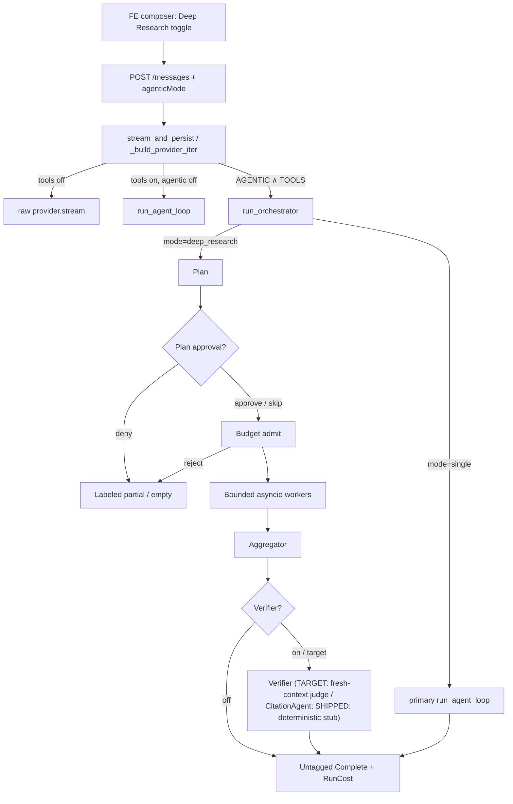

# Agent architecture (normative design)

**Status:** Design canon / decision record  
**Date:** 2026-07-14  
**Audience:** Anyone evolving the agent runtime, wire contract, or Deep Research UX

## Purpose

Define the **best agent architecture for Olune** — chat-anchored, flag-gated,
transparency-first — as lasting principles and evolution decisions. This is not
a generic agent essay and not a replacement for the build plan.

| Doc | Role |
| --- | --- |
| [`01-agentic-mode.md`](./01-agentic-mode.md) | **Build plan** for the shipped flag-gated engine (`AGENTIC_ENABLED` ∧ `TOOLS_ENABLED`; M0–M3 shipped, M4 partial). |
| **This doc (02)** | **Target architecture** — principles, topology, bounds, HITL, cost, observability, FE contract, shipped vs target gaps, and explicit non-goals. |

When 01 and 02 disagree on *intent*, 02 wins for direction; when they disagree
on *what code does today*, trust the as-built audit and the code. Close gaps by
changing code to match 02, then updating 01's remaining-gaps table.

**Provenance:** [research pass 2026-07-14](../research/2026-07-14/README.md) —
[industry brief](../research/2026-07-14/agent-architecture-industry.md) ·
[as-built audit](../research/2026-07-14/agent-architecture-as-built.md).

---

## Recommendation (normative)

**Default:** a single bounded ReAct / native tool-calling loop (today's
`run_agent_loop`).

**Opt-in Deep Research:** planner → bounded parallel workers → aggregator →
**(real) verifier**, with the **manager owning the user-facing answer**,
**chat-anchored in-turn only**.

Do not make multi-agent the default path. Most turns must not pay the ~15×
token tax of orchestrator-workers. Do not adopt peer swarm as the product shape.
Do not introduce Temporal (or equivalent durable execution) until there is an
explicit long-running workflow product surface.

---

## Topology

### Mermaid



### ASCII (as-built shape, target verifier noted)

```
POST /api/conversations/:id/messages
  body.agenticMode?: "single" | "deep_research"
        │
        ▼
routes/conversations.py
  • coerce deep_research → single if !Pro && !BYOK
  • budget_headroom_usd · resumable buffer × N when agentic
        │
        ▼
streaming/handler.py :: _build_provider_iter
  ├── tools off              → raw provider.stream
  ├── tools on, agentic off  → run_agent_loop
  └── AGENTIC ∧ TOOLS        → run_orchestrator
        │
        ├── single → primary run_agent_loop (+ subagent tags)
        │
        └── deep_research
              plan → (plan HITL?) → admit
              → asyncio workers under Semaphore(MAX_CONCURRENCY)
                    each = run_agent_loop(scoped prompt)
              → mid-flight budget kill on SubagentDone
              → aggregate (untrusted DATA framing)
              → verifier  [TARGET: real fresh-context judge;
                           SHIPPED: deterministic stub]
              → untagged Complete (summed usage) + RunCost
```

**Ownership rule:** the orchestrator / aggregator owns the reply
(manager-owns-answer / agents-as-tools). Workers never become the conversation
owner. Handoffs / peer swarm are out of scope for this product.

---

## Control phases (`deep_research`)

| # | Phase | Normative behavior |
| --- | --- | --- |
| 1 | **Plan** | Decompose into ≤ `AGENTIC_MAX_WORKERS` independent sub-questions; scale effort to complexity; persist the plan before truncation risk. |
| 2 | **Clarify (optional, target)** | Ask 1–3 clarifying questions before committing the ~15× budget when ambiguity is high. Product knob — not required for v1 enablement. |
| 3 | **Plan approval (HITL)** | When `AGENTIC_PLAN_APPROVAL`, pause with plan + **estimated** cost (`costConfidence: "estimate"`); resume via server-issued `toolApproval` ids only. |
| 4 | **Admit** | Pre-spawn worst-case estimate vs per-run cap + composed headroom; refuse spawn rather than silent overrun. |
| 5 | **Fan-out** | Concurrent workers under concurrency semaphore; each reuses `run_agent_loop` (rounds, timeouts, tool HITL, untrusted feedback). |
| 6 | **Mid-flight budget** | On each worker `SubagentDone`, true-up cost; on cap breach cancel unfinished work and proceed to partial synthesis. |
| 7 | **Aggregate** | Compose survivors as **structured / DATA-framed** inputs — never splice into system/safety instructions. |
| 8 | **Verify** | Prefer CitationAgent and/or **fresh-context** LLM-as-judge. Do **not** treat `AGENTIC_VERIFIER_N` as free-form majority vote over whole reports; reserve N-sample vote for closed-form sub-answers only. |
| 9 | **Finalize** | Untagged summed `Complete` + `RunCost`; persist subagent-grouped parts + per-worker attribution. |

`single` skips 1–8 fan-out: one `primary` loop, still chat-anchored.

---

## Hard bounds

Encode in config / code — never as prompt suggestions (OWASP LLM10:2025
Unbounded Consumption).

| Bound | Config (defaults) | Enforcement |
| --- | --- | --- |
| Master flags | `TOOLS_ENABLED`, `AGENTIC_ENABLED` (both required; boot-asserted) | Handler + `assert_prod_safe` |
| Max workers | `AGENTIC_MAX_WORKERS=4` | Planner truncate |
| Concurrency | `AGENTIC_MAX_CONCURRENCY=3` | Semaphore |
| Depth | `AGENTIC_MAX_DEPTH=1` | By construction (+ boot); raise only with eval proof |
| Per-run USD | `AGENTIC_RUN_BUDGET_USD=1.0` | Admit + mid-flight kill |
| Tool rounds / timeout | `TOOL_MAX_ROUNDS`, `TOOL_TIMEOUT_SECONDS` | `run_agent_loop` / `execute_tool` |
| Entitlement | Pro / BYOK for `deep_research` | Coerce to `single` |
| Resumable buffer | `AGENTIC_RESUMABLE_BUFFER_MULTIPLIER` | Conversations route |

On breach: **cancel in-flight work**, aggregate survivors, emit a **labeled
partial** outcome — never hang or silent overrun.

---

## HITL layers

| Layer | When | Mechanism |
| --- | --- | --- |
| Tool approval | Side-effecting tools inside any loop | Shipped `awaiting_approval` + `toolApproval` |
| Plan approval | Before expensive fan-out | Same terminal; plan + estimate in pause card |
| Clarify-before-plan | Optional, target | Product UX before plan/admit |
| Stop | User cancels turn | Cancel workers; flush completed partials (`stopped`) |

**Never** treat worker or model text as approval. Gates bind to **server-issued**
plan/tool ids only.

**Disconnect ≠ cancel** when resumable streams are on; only Stop cancels.

---

## Untrusted-output rules

1. Schema-validate tool **arguments** before execution; least-privilege tools.
2. Tool results and LLM strings are **untrusted** (OWASP LLM05 / LLM06).
3. **Transitive:** worker findings enter the aggregator as structured data /
   artifact refs only — never as system/safety instructions; never as HITL
   authority.
4. Prefer artifact refs over stuffing full worker text into the lead (telephone
   loss + token bloat) as a target improvement; inline DATA framing is the
   shipped minimum.

---

## Cost & attribution

- Run total = **sum of parts** (planner + workers + aggregator + verifier).
- Persist **per-worker** `ModelAttribution` (model/tier/substitution); **no
  silent downgrade**.
- `run_cost` meter (`subtotalUsd` / `capUsd`) is a product feature.
  - **Shipped:** estimate at plan pause + final at done (`orchestrator.py`;
    matches as-built audit — not per-worker mid-fan-out).
  - **Target:** mid-run ticks as workers complete (estimate + mid + final).
- Multi-agent research ≈ **~15×** chat tokens (industry published figure;
  `[verify-at-build]` against Olune metering). Entitlement-gate `deep_research`.

---

## Observability

OTel GenAI span tree (env-gated; no-op when unset):

- **Target tree:** parent request / workflow → `invoke_agent` per subagent
  (planner, worker, aggregator, verifier) → `execute_tool` / `chat` leaves.
- Spans carry ids, model/tier, token/cost rollups — **never message content**.

**Shipped:** `invoke_agent_span` on worker / primary / aggregator paths in the
orchestrator. Quiet planner and stub verifier emit **no** `invoke_agent` span.

**Target:** planner + real-verifier `invoke_agent` spans; wire
`execute_tool_span` in `agent_loop.py` (helper already defined).

---

## FE contract (additive, flag-gated)

| Surface | Contract |
| --- | --- |
| Bootstrap | `agenticEnabled = AGENTIC ∧ TOOLS` |
| Request | `agenticMode?: "single" \| "deep_research"` |
| SSE | Additive `subagentId`; `subagent_started` / `subagent_done` / `run_cost`; roles `primary` \| `worker` \| `aggregator` \| `orchestrator` |
| Persist | `SubagentPart` + tagged children; share view cost-stripped |
| UI | Deep Research toggle; `SubagentPanel`; plan-approval via tool-approval UI; `RunCostMeter` on `run_cost` (**shipped:** estimate @ plan pause + final; **target:** live mid-fan-out ticks) |

Flag-off: byte-identical stream path (proven). Flag-on `single`: behavioral
reuse of the loop **with** subagent tags — not wire-identical.

---

## Memory layering

| Layer | Scope | Olune stance |
| --- | --- | --- |
| In-turn scratch | One ReAct loop | Message list inside `run_agent_loop` |
| Orchestration state | One Deep Research run | Plan, worker outputs/refs, budget counters — **in-request only** |
| Thread / conversation | Cross-turn chat | DB messages; resumable stream buffer |
| Long-term user/org | Cross-thread | Account prefs / FR-40 memory — **not** orchestrator state |

No cross-turn orchestrator memory. No background agent state store.

---

## Failure / degrade paths

| Failure | Behavior |
| --- | --- |
| Flag off | Pre-agentic path; byte-identical |
| Non-entitled `deep_research` | Coerce to `single` |
| Admit reject | Explained empty / partial; no spawn |
| Plan deny | Labeled synthesis; no fan-out |
| One worker fails | Omit worker; synthesize survivors; `done` |
| Retryable worker error | Optional fallback route + substitution attribution |
| Budget breach mid-flight | Cancel unfinished; labeled partial synthesis; `done` |
| Stop | Cancel remaining workers; flush completed partials |
| Disconnect (resumable on) | Continue into buffer; not cancel |
| Verifier off / stub | Skip or append stub note; do not block answer |

---

## Shipped vs target vs out of scope

### Shipped (as-built) — keep

- Flag-off identity; `single` wrap + `deep_research` plan/fan-out/aggregate
- Hard bounds + admit + mid-flight kill; plan-approval HITL; Pro/BYOK coerce
- Untrusted DATA framing into aggregator; worker failure degrade + fallback
- Subagent-tagged SSE + persisted parts; attribution persist; buffer × N
- Real-provider planner/synthesis paths (deterministic no-network tests)
- `invoke_agent` OTel on worker/primary/aggregator; `execute_tool` OTel in `agent_loop`
- Orchestrator mid-run `run_cost` progress ticks (confirm handler/FE honesty labels)
- Honest verifier stub (no-op; N not billed); chat-anchored in-turn only; reuse `run_agent_loop`

### Target (gaps to close)

| Gap | Normative target |
| --- | --- |
| Verifier | Replace stub with CitationAgent and/or fresh-context judge; cost in meter; keep flag-gated. Stub today is honest no-op (no false "Verified…"; N not billed). |
| `AGENTIC_VERIFIER_N` semantics | **Documented** in config / `.env.example` / plan 01: not free-form majority vote; optional closed-form / future judge use only. Stub ignores N as independent samples. |
| Tool subsets | Least-privilege per-worker tool allowlists |
| Mid-run `run_cost` ticks | Orchestrator emits estimate + mid + final with `confidence`/`phase`; close handler encode + FE meter labeling before calling end-to-end done |
| `execute_tool` OTel | **Shipped** — wired in `agent_loop.py` |
| Planner / verifier `invoke_agent` spans | Span quiet planner + real verifier (stub today has none) |
| FE attribution display | Always-on per-worker served model (+ fuller callouts); substitution callout already exists in `subagent-panel.tsx` — gap is partial, not missing |
| High-cost composer hint / PRD 08 warning chip | Surface before spend / on partial synthesis |
| Clarify-before-plan | Optional HITL before plan/admit |
| Structured worker artifacts | Refs over full-text telephone into lead |
| Live E2E | True live-provider Deep Research E2E **before** prod `AGENTIC_ENABLED=true` |
| Depth runtime check | Keep default 1; assert at runtime if nesting ever lands |

### Out of scope (do not grow into)

| Non-goal | Why |
| --- | --- |
| Background / scheduled / out-of-turn daemons | D23/D33 chat-anchored guardrail |
| Peer-swarm as default ownership | Confuses brand reply ownership + attribution |
| Temporal / durable workflows | No product surface for multi-hour / crash-proof runs yet |
| Agent SDK / user-authored graphs / platform | PRD anti-goal |
| Second loop engine | Subagents reuse `run_agent_loop` |
| Cross-turn orchestrator memory | FR-40 is account memory, not run state |
| OpenAI-style long-horizon single-agent as **default fan-out** | See decision table — keep as evaluated alternative for non-parallelizable research |

---

## Decision table

| Decision | Choice | Rationale |
| --- | --- | --- |
| Default path | Bounded single ReAct loop | Simplicity first; most turns must not pay ~15×; Anthropic "start simple"; OpenAI also shows strong single-agent research exists |
| Deep Research shape | Orchestrator-workers (manager-owns-answer) | Best-supported published pattern for **parallel breadth**; matches shipped 01 engine; separate contexts compress search |
| Why **not** OpenAI-style long-horizon single-agent as the Deep Research **fan-out default** | Keep single-loop as `single` / non-DR path; do not replace orchestrator with one long ReAct as the opt-in DR mode | Olune's product bet for the toggle is parallel breadth + per-worker attribution + plan HITL. Long-horizon single-agent remains a **competing architecture** to evaluate for sequential / non-parallelizable queries — not the DR default |
| Why **not** swarm | Manager owns the microphone | Peer handoffs confuse identity, guardrails, and cost attribution in a single-brand chat product |
| When durable execution becomes relevant | Explicit product mode for runs that outlive SSE/worker lifetime, multi-hour HITL, or crash-proof progress | Until then: in-request asyncio + resumable buffers + Stop≠disconnect. Temporal is a product decision, not a silent chat-turn evolution |
| Depth default | 1 | Blocks recursive orchestrator trees; raise only with eval proof |
| Verifier | Fresh-context judge / CitationAgent | Self-grade bias; Wang majority vote is for closed-form answers, not free-form reports |

---

## Competing architectures

| Shape | Summary | Fit for Olune |
| --- | --- | --- |
| **OpenAI Deep Research (long-horizon single-agent)** | One strong ReAct-style browse/reason trajectory; caps on iterations / wall-clock / fetches | Excellent for sequential research and as the **default `single` path**. Not the opt-in DR fan-out shape — would drop parallel context windows, plan HITL fan-out, and per-worker attribution UX the product already ships |
| **Anthropic Research (orchestrator-workers)** | Planner → parallel subagents → synthesis → CitationAgent / fresh-context eval; ~15× tokens; hard ops bounds | **Olune pick for `deep_research`.** Aligns with shipped topology; industry lessons map 1:1 to our bounds, HITL, untrusted-output, and cost meter |
| **Peer swarm / handoffs** | Specialists own the turn after transfer | Support-triage niche only; **not** Deep Research |
| **Graph / durable workflow** | LangGraph / ADK / Temporal checkpointed runs | Future **explicit** mode if runs outlive chat turns; premature as the SSE default |

**Pick:** default single bounded loop + Anthropic-style orchestrator-workers for
opt-in Deep Research, with deterministic budget/HITL/observability shell.

Confidence note: Anthropic's published gains are on *their* evals; OpenAI's
single-agent DR is competitive. Olune must keep a local golden set and re-eval
before raising depth, worker counts, or claiming multi-agent superiority on
every query class.

---

## Open questions / remaining gaps

Aligned with the as-built audit. Plan 01's remaining-gaps table tracks build-plan
status; this section owns **target** decisions and **deferred hard gaps**.

1. **Real verifier** — CitationAgent vs fresh-context rubric judge vs both;
   cost accounting; keep `AGENTIC_VERIFIER` default off until proven.
2. **`AGENTIC_VERIFIER_N`** — documented in `config.py` / `.env.example` / plan 01:
   not free-form majority vote; reserved for a future closed-form / judge path;
   stub does not run N provider samples. Redefine the knob when a real verifier
   ships.
3. **Per-worker tool subsets** — default scoped allowlist (least privilege).
4. **Mid-run `run_cost` ticks** — orchestrator emits estimate / mid / final;
   finish handler encode + FE meter honesty labels if not already complete.
5. **`execute_tool` OTel** — **closed** (wired in `agent_loop.py`); keep
   planner/real-verifier `invoke_agent` spans as remaining observability work.
6. **Live-network E2E** — hard gate before prod enablement of `AGENTIC_ENABLED`.
7. **Clarify-before-plan** — latency vs budget-control trade; product call.
8. **Artifact store vs inline worker text** — direction high confidence;
   implementation open.
9. **Sync vs async worker batches** — shipped sync wait is fine; async is a
   deliberate upgrade (head-of-line today).
10. **Silent entitlement coerce** — whether to surface a FE callout when
    `deep_research` is coerced to `single`.
11. **Partial-synthesis chip** — PRD 08 warning chip vs prose-only labeling.
12. **FE attribution display** — always-on per-worker served model (+ fuller
    callouts); substitution callout already shipped on reload from persisted
    parts; live-stream attribution and public per-worker identity remain open.
13. **Worker HITL resume (BE-005)** — tool `awaiting_approval` inside a worker /
    aggregator does not suspend and resume that subagent; the handler stops on
    the first pause and a later `toolApproval` starts a new whole orchestrator
    rather than continuing the paused worker. Hard deferred; do not claim shipped.
14. **Approval idempotency (BE-007)** — approved side effects are not claimed /
    settled transactionally before execution; a post-execution stream failure can
    re-run the side effect on retry. Hard deferred; needs idempotency key +
    settle-before-execute.

---

## Invariants (must hold)

1. Flag-off byte-identical to pre-agentic stream.
2. Flag-on `single` = behavioral loop reuse + tags (not wire-identical).
3. Chat-anchored in-turn only — no out-of-turn execution.
4. Every subagent reuses `run_agent_loop`.
5. One seam: `_build_provider_iter`.
6. Additive wire + parts accumulation.
7. Untrusted transitive worker output into aggregator.
8. Budget halt → graceful labeled `done`, never opaque error hang.
9. Last untagged `Complete` wins for roll-up cost.
10. `AGENTIC_ENABLED` requires `TOOLS_ENABLED` at boot.
11. Disconnect ≠ cancel under resumable streams.
12. Plan approval reuses `toolApproval` — no parallel pause primitive.
13. No silent model downgrade inside a fan-out.
14. Manager owns the answer; workers are tools, not conversation owners.

---

## Related docs

- Build plan: [`01-agentic-mode.md`](./01-agentic-mode.md)
- PRDs: [`02` AI capabilities](../prd/02-ai-capabilities.md),
  [`07` transparency](../prd/07-transparency-contract.md),
  [`08` errors/limits](../prd/08-error-and-limit-states.md)
- Research: [2026-07-14 pass](../research/2026-07-14/README.md)
