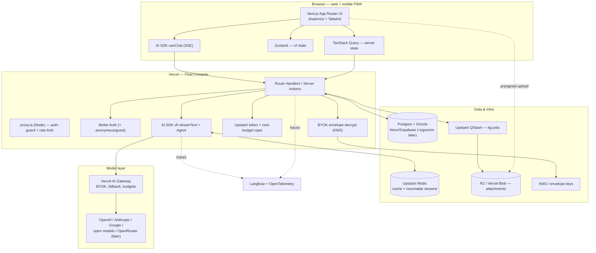

# PRD 04 — Technical Architecture

**Product:** A transparent, multi-model, cost-leading AI chat for web and mobile (mobile-web first).
**Primary persona (MVP):** Power users / developers. Secondary: privacy-conscious prosumers.
**Document type:** Engineering requirements / technical design (the buildable spec).
**Status:** Draft for build. Fast-moving facts are tagged **[confirm at build]**.
**Date:** 2026-05-27.

> **Priority tags:** **[P0/MVP]** = required to ship the MVP. **[P1]** = fast-follow, design for it now. **[P2]** = later / explicitly deferred.
> **Confidence:** facts the team must re-verify before locking implementation are marked **[confirm at build]** (e.g., exact Vercel max-duration). Contested compliance dates carry an explicit **[VERIFY]** flag requiring legal sign-off.

---

## 1. Summary & purpose

This document converts the architecture research into a buildable engineering spec for the MVP and the immediate fast-follow. It defines the stack per layer, the streaming/resumability design, the data model, the provider-abstraction and BYOK security model, file uploads, cross-cutting concerns (rate limiting, jobs, observability), the security/privacy non-functional requirements, and the deployment/portability strategy.

The guiding principle is **MVP-fast-but-not-cornered**: pick pragmatic, Vercel-native defaults to ship quickly, but place every external dependency (provider, storage, auth, queue, cache, tracing) behind a thin adapter so a later move to Cloudflare, containers, OpenRouter, or LiteLLM is a *migration, not a rewrite*.

Three product constraints drive the architecture and are non-negotiable across all PRDs:
1. **Multi-provider model support from day one** via a thin provider-abstraction layer.
2. **Per-message transparency** — the data model captures the model used *and* token/cost usage *per message*.
3. **Privacy-first** — no-train-by-default, short configurable retention, one-click export/delete, and **guest/anonymous sessions** (chat before sign-up, then upgrade/link account).

---

## 2. Goals & non-goals (technical)

### Goals
- Ship a hosted, streaming, multi-model chat MVP on a TypeScript-first stack with the smallest viable service count.
- Make model choice, per-message model attribution, and per-message token/cost a **first-class part of the data model**, not an afterthought.
- Support **guest sessions** with seamless upgrade/linking to a real account, with no data loss on upgrade.
- Survive serverless function timeouts and network drops for long AI streams (resumable streams).
- Keep COGS controllable: rate-limit by user *and* IP (for guests), route work off the request path, and support BYOK.
- Keep the whole stack portable behind adapters; avoid one-way doors.
- Meet baseline security/privacy NFRs (encryption, key handling, no-train default, export/delete, AI-interaction disclosure).

### Non-goals (MVP)
- **[P2]** Native mobile apps — mobile is responsive web / PWA for MVP (see PRD 03).
- **[P2]** True live multi-device sync via WebSockets — defer; resumable streams + refetch first.
- **[P2]** RAG / document chat ingestion pipeline — schema reserves space (pgvector) but it is not built day-1.
- **[P2]** Voice (STT/TTS) — would pull WebSockets/Durable Objects forward; out of MVP scope.
- **[P2]** Self-hosted gateway (LiteLLM), SSO/SAML, SOC 2 audit — designed-for, not built for MVP.
- **[P2]** A separate vector DB (Pinecone) — only at large scale.

---

## 3. Architecture overview + reference diagram

The system is a **Next.js 16** App Router web app (responsive PWA for mobile) with **Cache Components / PPR** as the rendering baseline (static shell instant, chat pane streamed) talking to Vercel serverless route handlers / server actions. Auth-guard and rate-limit interception live in **`proxy.ts` on the Node runtime** (the Next.js 16 successor to the deprecated Edge `middleware.ts`). The chat loop runs through the **Vercel AI SDK v6** (`streamText` / `useChat`) over SSE, with a Redis-backed resumable-stream layer for refresh/drop resilience. A thin provider layer (AI SDK providers behind the AI Gateway) fans out to model providers. Postgres (Drizzle) is the system of record; Upstash Redis backs cache + resumable streams; Upstash QStash runs background jobs; object storage holds attachments uploaded directly by the client via presigned URLs. Langfuse + OpenTelemetry (OTel GenAI semantic conventions) provide tracing.



ASCII fallback:

```
Browser (Next.js + useChat/SSE, Zustand, TanStack Query)
   |  HTTP/SSE                                  \ presigned upload (direct)
   v                                             v
Vercel Route Handlers / Server Actions     Object storage (R2 / Vercel Blob)
  | auth   | rate-limit | byok-decrypt | stream | bg-job        ^
  v        v            v             v        v                |
BetterAuth Upstash     KMS          AISDK     QStash -----------+
                                     |
                                     v
                            Vercel AI Gateway --> OpenAI / Anthropic / Google / open / OpenRouter
  Postgres+Drizzle (chats/messages/usage)   Upstash Redis (cache + resumable streams)
                       \________ OTel traces ________/  -->  Langfuse
```

---

## 4. Stack decision table

| Layer | Choice (MVP) | Rationale | Main tradeoff | Alternative (when) |
|---|---|---|---|---|
| **Frontend** | **Next.js 16** App Router + **Cache Components (PPR)** + shadcn/ui + Tailwind; responsive **PWA** for mobile | Largest ecosystem; the leading reference apps + the AI SDK's richest features are built here, so we inherit streaming/resumable/persistence patterns; PPR gives static-shell-instant + streamed-chat-pane natively | App Router (RSC/caching/streaming) learning curve; async `cookies()/headers()/params` migration; mild Vercel gravity | React Router v7 / SvelteKit if team rejects RSC |
| **AI orchestration** | **Vercel AI SDK v6** (`ai@6.x` + `@ai-sdk/*`): `useChat` + `streamText`, `Agent` primitive, tool calling | Collapses streaming protocol, tool-call streaming, message typing, provider switching, resumable streams into one maintained lib; v6 adds the `Agent`/`ToolLoopAgent` primitive (+ `needsApproval` HITL), stable MCP, `Output.object()` | v6→v7 API churn — **pin exact versions (no `^`)** + lockfile + a manual-gate Renovate/Dependabot (v6 patches multiple times/week), isolate behind adapter, follow migration notes. **AI SDK v7 is in active public beta as of May 2026** (not a distant horizon) — plan the v6→v7 codemod (`npx @ai-sdk/codemod`) in **P1**; `generateObject`/`streamObject` deprecated (use `Output.object()`) | LangChain.js (heavier) only if agent complexity grows |
| **Transport** | **SSE** (AI SDK default) + Redis-backed resumable streams; **dedicated stop endpoint** (abort via `AbortSignal` only pre-resumable) | Native, debuggable, robust; resumable streams survive refresh/timeout | No bidirectional (fine for chat); abort semantics invert under resumable streams — every stop is a disconnect (§5.1) | WebSockets / Durable Objects if voice/collab lands; **Vercel Workflows / DurableAgent** (durable execution) as the P1 long-run / agent-loop horizon |
| **Provider layer** | AI SDK providers + **Vercel AI Gateway** (BYOK, fallback, budgets, **ZDR**); thin adapter interface | One key → many models; zero-markup BYOK; usage/budget controls; ZDR as **defense-in-depth** (provider DPAs/no-train modes are the primary no-train control, §5.7) | Gateway lock-in (mitigated by adapter); **ZDR is plan-gated — per-request ZDR free on Pro/Ent, team-wide ZDR metered ($0.10/1k req), unavailable on Hobby** | OpenRouter (breadth) / LiteLLM (self-host) / **Portkey (OSS, self-host + built-in guardrails)** later |
| **Database** | **Postgres + Drizzle** on Neon or Supabase | Serverless-friendly cold starts; SQL control; working pgvector for future RAG. Neon (now Databricks-owned, runs independently) cut storage/compute pricing materially in 2026 | Drizzle is more SQL-forward, less "batteries-included"; the cold-start gap vs Prisma is `[Recall]` — re-benchmark on Neon + Fluid Compute before quoting | Prisma if DX wins out and pgvector not needed |
| **Cache / Redis** | **Upstash Redis** (HTTP/REST) | No connection pooling, no cold-start penalty; same Redis backs resumable streams + rate limiting | HTTP-per-op latency vs persistent client | Self-managed Redis at scale |
| **Background jobs** | **Upstash QStash** (HTTP queue: retries, delay, DLQ) | Fits serverless without a worker fleet; idempotent retries | HTTP-queue semantics; not a full broker | SQS / a worker fleet at scale |
| **Auth** | **Better Auth** (anonymous plugin → account linking) — **committed** | Owns users in *our* Postgres; best guest→account upgrade; passkeys/2FA/orgs built in; no per-MAU bill. Auth.js is now security-patch-only and its own maintainers (the Better Auth team, since Sept 2025) point new projects to Better Auth | Newer lib we operate; enterprise SSO/SAML/SCIM still maturing | **Supabase Auth** *only if* we standardize the data platform on Supabase (RLS synergy). ~~Auth.js~~ dropped — deprecated path |
| **Object storage** *(P1 — lands with attachments)* | **Cloudflare R2** (S3-compatible, presigned PUT); **Vercel Blob** acceptable | Zero egress fees at scale; direct client uploads keep files off function compute | R2 ecosystem younger; not needed until file attachments (P1) | S3 (max maturity, egress cost) behind same adapter |
| **Secrets / BYOK** | KMS-backed **envelope encryption** for user keys | Keys encrypted at rest, scoped per user, never logged | Adds a KMS dependency | Cloud-provider KMS equivalent on migration |
| **Observability** | **Langfuse v4 (OTel-native)** + **OpenTelemetry GenAI semantic conventions** | OSS, tracing + prompt mgmt + evals; Langfuse v4 consumes OTel so it's *one* instrumentation surface, not two; OTel GenAI semconv (client spans stable-ish) avoids APM lock-in | Self-hosted Langfuse now needs ClickHouse + Postgres + Redis/S3 (non-trivial ops) — prefer cloud tier for MVP | Any OTel-compatible APM (Datadog/Grafana ingest GenAI semconv natively); Helicone as an observability-first proxy complement |
| **Deploy** | **Vercel** (Fluid Compute) for MVP | Fastest to ship; best AI SDK/Gateway/streaming integration; OTel export. Fluid Compute default now **300s on all plans**, **max 800s on Pro/Enterprise** (>300s requires Pro/Enterprise) **[confirm at build against Vercel duration docs]** | Function max-duration limits; cost/egress at scale | Cloudflare (Workers/DO/Containers) or Fly/Railway at scale; **Vercel Workflows** for durable long runs (proprietary — gate behind adapter; Temporal/Restate as portable equivalents) |

**One-line summary:** Next.js App Router + Vercel AI SDK over SSE (resumable) + Postgres/Drizzle + Upstash + Better Auth + R2 + Langfuse, on Vercel, with every external dependency behind a thin adapter.

---

## 5. Detailed requirements by area

### 5.1 Streaming & resumable streams

- **[P0/MVP]** Default transport is **SSE** via the AI SDK (`streamText` server-side, `useChat` client-side). Token-by-token streaming is the core UX requirement (TTFT is a tracked metric — see PRD 05 §7). SSE caveats to enforce at build: HTTP/1.1 caps **6 SSE connections per domain per browser** across tabs (HTTP/2 ≈100; Vercel serves HTTP/2+, which mitigates the multi-tab case), and **proxy/CDN response buffering can defeat token streaming** — set no-buffering headers / keep-alives.
- **[P0/MVP]** Run the chat route on the **Node runtime** (richer library surface, safe streaming) on **Fluid Compute** to maximize stream duration. Fluid Compute default is now **300s on all plans**, **max 800s on Pro/Enterprise** (>300s requires Pro/Enterprise). **[confirm at build]** the exact current limits against [Vercel duration docs](https://vercel.com/docs/functions/configuring-functions/duration) before locking timeouts.
- **[P0/MVP] Stop / abort — semantics invert when resumable streams turn on:**
  - **MVP (no resumable replay):** `useChat` stop closes the client stream; an `AbortSignal` propagates into `streamText` so the upstream provider request is cancelled (stop billing). On abort, persist the partial assistant message and mark the run aborted. This is simple and correct *because there is no resumable layer*.
  - **The moment resumable replay lands (P1):** client-side aborts (`stop()`, refresh, tab close, network loss) are all treated as **disconnects by design and do NOT cancel generation** — the server keeps producing so the client can reconnect. Stop must therefore become a **dedicated server-side stop endpoint** (out-of-band cancel), *not* a client `AbortSignal`. This is a documented behavioral switch: **the abort behavior inverts between MVP and P1**, and building it naively will silently re-introduce bill-until-timeout for *every* stop once resumability ships. ([ai-sdk.dev resume-streams](https://ai-sdk.dev/docs/ai-sdk-ui/chatbot-resume-streams), [vercel/ai #8390](https://github.com/vercel/ai/issues/8390).)
- **[P0/MVP] Interrupted-stream UX (no resumable replay):** network drops, server errors, and user Stop all end with a **persisted partial assistant message** in `message.parts` and `stream.status = aborted` (or `error`). The client does **not** SSE-resume in P0. PRD 01/03 own the surface: inline **Continue** (re-submit continuation context as a new turn) and **Regenerate** (re-run last user message). *AC:* partial tokens survive reload; Continue/Regenerate never silently discard partial content.
- **[P1] Resumable streams:** wrap the SSE stream with Vercel's `resumable-stream` library, backed by **Upstash Redis pub/sub** (validated: one `INCR` + `SUBSCRIBE` per stream; minimal Redis cost unless a resume happens). On reconnect (page refresh / network drop on the *same* device) the client replays buffered tokens from the last cursor — **best-effort, subject to Redis retention; not a guarantee of lossless replay across arbitrary outages.** Requires: persist the in-progress assistant message *and* track the active stream id per chat (the `Stream` table). Design the persistence for this in MVP even if resumable replay ships as P1. **Build-time watch items:** known resume bugs where a resumed stream starting with a `text-delta` for an existing part fails ([vercel/ai #13160](https://github.com/vercel/ai/issues/13160)) and tab-backgrounding resume issues ([#11865](https://github.com/vercel/ai/issues/11865)).
- **[P0/MVP with resumable streams → PRIMARY stop path] Orphaned-run handling (not an edge case):** once resumable streams are on, **every** stop/refresh/close is a disconnect that does not reach the generating process — so out-of-band cancel is the **primary stop mechanism**, and it must exist the moment resumable streams ship. Mechanism:
  - A **dedicated stop endpoint** persists the partial message, cancels the producing work, clears `activeStreamId`, and writes `aborted` to the `Stream` row.
  - The `Stream` row is the source of truth for run state (`active | done | aborted`); the stop endpoint publishes an abort signal on the Redis channel for that stream id.
  - The generating process polls/subscribes to that channel (or checks the row at each step boundary) and self-cancels its `AbortSignal` when it sees `aborted`.
  - A **reaper** (QStash scheduled job) backstops by marking `active` streams older than max-duration as `aborted` and reconciling their messages.
  - **Degraded-path UX:** on reconnect when the Redis buffer has been evicted, show the persisted partial + "generation interrupted, retry." On a concurrent send to a chat that already has an `active` stream (unique-active-stream index violation), return `409` + "a response is already generating in this chat."
- **[P0/MVP] Long-stream-vs-timeout constraint:** functions cannot stream indefinitely. Layered mitigations: (1) resumable streams (resume after a drop/timeout), (2) Fluid Compute for longer single runs (Cloudflare 5-min CPU Workers as the portability escape hatch), (3) push heavy/long non-token work (file processing, embeddings, title generation) to **QStash background jobs**, never the request path. **[P1 horizon] Vercel Workflows / `DurableAgent`** is the strategic answer for the **P1 tool/agent loop and any multi-minute generation**: it checkpoints state at every `await`, survives timeouts/deploys/crashes, provides durable streams, and solves the orphaned-run problem structurally (steps are individually checkpointed/retried/cancelled), collapsing resumable-stream + reaper + background-job into one durable-step model. It is **Vercel-proprietary** — gate it behind the runtime adapter (Temporal/Restate + AI SDK are portable equivalents). Don't pull it forward for the text-core MVP.
- **[P0/MVP] Client error contract (`useChat`):** wire streaming failures through the AI SDK hook surface, not ad-hoc fetch parsing. Surface `error` from `useChat` in the assistant bubble footer; recovery actions are **`regenerate()`** for stream/provider failure and **`clearError()`** after dismiss/retry so the composer re-enables. Preserve partial `message.parts` on error. Emit one terminal analytics event per assistant turn from lifecycle finish handling: `completed` | `stopped` | `error` | `interrupted`, with `chat_id`, `message_id`, `model_id`, `served_model_id` (if substitution), and token/cost snapshot when available.
- **[P0/MVP] Message-send idempotency key (billing-consistency, OWASP LLM10):** the client generates a **`client_message_id` (UUID v4)** per user send intent and includes it in the `/api/chat` send payload. Because `message.cost_usd` (§6) is the **live billing ledger**, a single user intent must never spawn duplicate assistant turns under network retries, double-clicks, optimistic-send replays (PRD 00 "optimistic send + offline draft/queue"), or `regenerate()`. The route handler **dedupes on `client_message_id` BEFORE any provider call or ledger write** (a duplicate returns the existing turn / its in-progress stream, never a second generation). Stored as `message.client_message_id`, **unique per chat** (§6). *AC:* replaying the same `client_message_id` to a chat produces at most one assistant turn and at most one ledger write — no double-charge.
- **[P0/MVP] Billing-vs-stream-failure atomicity (order-of-operations):** define exactly **when** `cost_usd` / `usage_rollup` is written relative to a stream that may complete, stop, error, or be interrupted — to avoid bill-for-nothing (charge then stream dies) and stream-for-free (tokens consumed, never metered):
  - **Capture** provider usage from the AI SDK lifecycle (`onFinish` / terminal events), covering all four terminal states the §5.1 client error contract already emits — `completed` | `stopped` | `error` | `interrupted`.
  - **Write** the cost ledger (`message.cost_usd` + `cost_breakdown`, `usage_rollup`) in the **same transaction/step** that finalizes the `message` + `stream` row — never as a separate, unguarded write.
  - **Meter partial usage on abort:** provider-reported tokens on a stopped/interrupted run are still metered (the persisted partial `message.parts` carries a real, billable cost); a run that never produced billable usage writes zero.
  - **Reconcile** orphaned runs via the **reaper** (§5.1 / QStash): a `Stream` row marked `aborted` by the reaper finalizes its message + ledger from the last captured usage so no run is left unmetered or double-metered.
  *AC:* every terminal state writes exactly one ledger entry atomic with message+stream finalization; a stream that dies mid-flight meters only the provider-reported partial usage; reaper-reaped orphans are metered exactly once.

### 5.2 Provider abstraction & BYOK

- **[P0/MVP] Thin provider adapter:** all model calls go through one internal interface (`ModelProvider`) that wraps AI SDK providers behind the **Vercel AI Gateway**. App code references models by stable ids (e.g. `openai/gpt-...`, `anthropic/...`); swapping the gateway for OpenRouter or LiteLLM must not touch call sites.
- **[P0/MVP] Structured outputs (v6 API):** the MVP ships "structured outputs + schema validation" (PRD 00 §5). Build this against **`streamText`/`generateText` + `Output.object()`** — the standalone `generateObject`/`streamObject` helpers are **deprecated in AI SDK v6**. Do not build the MVP against the deprecated helpers.
- **[P1] Tool/agent loop (v6 `Agent`):** use the v6 **`Agent`/`ToolLoopAgent`** primitive (typed stop conditions `stepCountIs()`/`hasToolCall()`, stable MCP) rather than hand-rolling multi-step. Use **`needsApproval`** for human-in-the-loop tool-execution approval. Keep the AI layer isolated behind the provider adapter (migration discipline now points at v6→v7).
- **[P0/MVP] Multi-provider from day one:** the **main provider is DeepSeek** (the cost-leading default for free-tier / casual queries; PRD 02/05 own the registry), with OpenAI, Anthropic, and Google as selectable picker routes / alternate backends (see PRD 05 §3; PRD 02 §5.3 owns the model-selection rule).
- **Current implementation (MVP deploy):** the deployed BE binds the OpenAI-compatible adapter to the DeepSeek-hosted API as the main provider. Config today: `PROVIDER_BACKEND=openai`, `OPENAI_BASE_URL=https://api.deepseek.com`, and per-tier overrides `OPENAI_MODEL_FAST` / `OPENAI_MODEL_SMART` / `OPENAI_MODEL_AUTO` = `deepseek-chat` with `OPENAI_MODEL_PRO=deepseek-reasoner` (env-var names match `api/app/config.py` and `api/.env.example`). This matches the main-provider/default decision in **PRD 00 §11 D11** and the model-selection rule in PRD 02 §5.3.
- **[P0/MVP] Per-message model + usage capture:** every assistant message records the resolved `model_id`, `provider`, and token usage (prompt/completion/total) and a computed cost. The cost field must be able to represent **effective/tiered cost** (cached-input, threshold/long-context multipliers, promos), not just a single scalar — **PRD 02 owns the pricing schema** that produces these multipliers, **PRD 01 owns the display**, this PRD owns the **storage/capture** shape (§6). This powers the transparency UX (model used + token cost per message), unit-economics metrics, **and** the live budget-enforcement signal (§5.6). **This is a hard cross-PRD contract.**
- **[P0/MVP] BYOK key security:**
  - Encrypt user-supplied keys at rest with **envelope encryption** (data key per record, master key in KMS). Store only ciphertext in `api_key.encrypted_key`.
  - **Never log keys**; redact in error traces; never place keys in system prompts (OWASP LLM system-prompt-leakage risk).
  - Scope keys per user; decrypt only in-process at call time; never return plaintext to the client.
  - Use a **fresh data-encryption key (DEK) per record (AES-256-GCM)** wrapped by the KMS master key; store unique `(user_id, provider)`, `last_used_at`/`updated_at`, and support **soft-delete/revocation/rotation** (§6 `api_key`).
- **[P0/MVP] Guest + BYOK policy:** **BYOK requires a non-anonymous account.** A guest gets a real `user` row (FK works) but its identity is evictable and may never upgrade — storing a provider key against it is a key-security/abuse hazard. Gate key entry on a real account.
- **[P0/MVP] BYOK UI gate:** hide key-entry controls and block `api_key` writes when `user.is_anonymous = true`; show upgrade-to-link-account CTA (PRD 01 §4.8).
- **[P0/MVP] Grok registry gating:** registry seed may include xAI/Grok via gateway/OpenRouter breadth, but set `default_route_eligible = false` until `data_policy` review passes PR-1. Auto-routing and free-tier defaults MUST NOT select Grok.
- **[P0/MVP] Platform-keys vs BYOK policy:** platform keys = we pay, we meter and rate-limit (default for free/Pro tiers); BYOK = user pays, we proxy with no token markup. The Gateway makes the BYOK proxy path simple. Metering/limits apply to platform-key usage; BYOK usage is still rate-limited for abuse but not metered for billing.
- **[P1] Provider drift handling:** model ids and capabilities (tools, vision, reasoning) move fast — keep a capability registry per model so the UI can gate features (e.g. vision-only models) and the adapter can fall back.

### 5.3 Data model — see §6 for the full draft schema

- **[P0/MVP]** Postgres + Drizzle is the system of record. Client state (Zustand for UI, TanStack Query for server state) is a cache; the DB is authoritative.
- **[P0/MVP]** Required tables for MVP: `user` (with `is_anonymous`), `chat` (with `visibility` + `model_id`), `message` (**typed multi-part `parts`** + attachments jsonb + per-message model + token + effective/tiered cost), `stream`, `vote`, **`api_key` (BYOK — P0 per the launch-BYOK decision)**.
- **[P0/MVP] Typed multi-part message model (THIS PRD owns the data-model schema):** a `message` is an **ordered list of typed parts** — `text | reasoning | tool-call | tool-result | citation | interactive-block` — not a single markdown string. Modeling this in the P0 data layer (even if P0 only *renders* the text/reasoning/code subset) de-risks tools, structured citations, interactive viz, and generative UI in one move; skipping it guarantees a P1 refactor. **PRD 01 references this for rendering** (the rendering decision is really a data-model decision and is made here once).
- **[P0/MVP] `tool-call` part shape (schema now, minimal renderer):** even before tools ship (P1), `message.parts` MUST accept persistable tool/status parts so PRD 01 status lines are not throwaway. Minimum fields: `type: 'tool-call'`, stable `id`, `toolName` or `displayLabel`, `status: 'pending' | 'running' | 'completed' | 'failed' | 'denied'`, nullable `input`/`output` jsonb, nullable `error`, optional `startedAt`/`completedAt`. P0 UI may render these as status lines only; expandable tool UI is P1.
- **[P1]** `attachment` (file upload lands with vision/PDF understanding), `document` + `suggestion` (artifacts).
- **[P2]** `embedding` (RAG, pgvector) — reserve the design, do not build.

### 5.4 Storage & file uploads

> **Phase note:** file attachments are **P1** (they land with vision/PDF understanding — see PRD 02 §4.8). The lean text-core MVP ships no upload flow; this section is the **P1** design (build the adapter interface when attachments land, not before).
> **P0 rule:** do not ship presigned upload, `attachment` writes, or mobile attach UI in P0. Attach affordances land with P1 vision/PDF.

- **[P1] Presigned direct-to-storage upload:** client requests a presigned PUT URL from our API → browser uploads **directly** to object storage (keeps large files off function compute/timeout budget) → API writes the `attachment` row with object URL + metadata.
- **[P1] Validation:** server issues presigned URLs only for allowed content-types and a max size; verify object existence + size after upload before marking `ready`.
- **[P1] Async processing via queue:** thumbnailing/resize, PDF/text extraction (for future RAG), virus/abuse scanning run as **QStash background jobs**, never inline. `attachment.status` transitions `uploaded → processing → ready | failed`.
- **[P1] Storage adapter:** wrap R2/Blob/S3 behind one interface so R2 ↔ Blob ↔ S3 swaps are config, not code.

### 5.5 Auth & guest sessions

- **[P0/MVP] Guest/anonymous sessions are a hard requirement.** A first-time visitor can start chatting with **no sign-up**. The anonymous user gets a real `user` row with `is_anonymous = true`.
- **[P0/MVP] Upgrade / link:** on sign-up or OAuth login, the anonymous account is **linked/merged** into the real account with **no chat loss** (chats/messages re-parented to the upgraded user id). Better Auth's anonymous plugin provides anonymous→link natively.
- **[P0/MVP] Guest cost control:** guests are rate-limited by **IP** (and by anonymous user id) to cap model spend — see §5.6.
- **[P1]** Passkeys / 2FA, organizations / RBAC (Better Auth has these built in; enable as team features mature).
- **[P2]** SSO / SAML for teams (later — see §5.7).
- **Decision note / spike:** Better Auth is **committed** (owns users in our Postgres, best guest→link; aligns with PRD 00's Better Auth commitment). The **only** alternative is **Supabase Auth** (RLS synergy + anonymous sign-in), contingent on standardizing the data platform on Supabase. **Auth.js is dropped** — it is security-patch-only as of Sept 2025 and its own maintainers (now the Better Auth team) point new projects to Better Auth ([better-auth.com/blog/authjs-joins-better-auth](https://better-auth.com/blog/authjs-joins-better-auth)). *Spike (still open): prove guest→account linking with no data loss **in Better Auth** — auth is the hardest dependency to migrate (password hashes, sessions, OAuth links, the anonymous→linked graph), so validate the linking path before lock.*

### 5.6 Rate limiting, jobs & observability

- **[P0/MVP] Rate limiting — token + cost-budget aware, not request-count-only (OWASP LLM10 Unbounded Consumption):** a request-count window bounds request *rate*, not token/$ *spend* — one request can be 200k tokens, which is the real "inference whale" exposure (PRD 05 §3; §8 Risk #5). Build a multi-layered limiter on Upstash Redis + `@upstash/ratelimit`, limited **by authenticated user AND by IP for guests/anonymous**:
  - **(a) request-rate limits** (sliding window) per bucket: message send, model calls, file uploads.
  - **(b) token-rate limits** (tokens/window) so a single huge request is bounded.
  - **(c) per-user rolling cost-budget caps** enforced off the `message.cost_usd` ledger (§6) — the live spend signal, especially for guests/free tier.
  - **(d) circuit breaker** for runaway multi-step / tool runs (trips when an agent loops on an expensive tool — critical when the P1 tool loop lands).
  - **(e) Gateway budgets** as a second enforcement layer.
  Return `429` with retry-after; surface a clear UI state. **Budget/metering hook (cross-PRD):** this limiter is also the **enforcement mechanism** for the P0 metered-overage/credit primitive PRD 05 is adopting — expose the per-user budget/spend reads against the `message.cost_usd` ledger as the metering hook. **PRD 05 owns the monetization/credit decision; this PRD owns enforcement.** ([genai.owasp.org LLM10 Unbounded Consumption](https://genai.owasp.org/llmrisk/llm102025-unbounded-consumption/), [zuplo token-based rate limiting](https://zuplo.com/learning-center/token-based-rate-limiting-ai-agents).)
- **[P0/MVP] Caching:** Upstash Redis for session/state and hot reads (conversation list, model registry). Same Redis instance backs resumable streams. Layer **Next.js 16 Cache Components (`"use cache"`)** for those hot reads (RSC-level caching pairs with the Upstash layer). **Build gotcha:** `cookies()/headers()/params/searchParams` are **async** in Next.js 16 — `await` them in every Better Auth session read in route handlers.
- **[P1] Background jobs:** Upstash QStash for attachment processing, embeddings, **title generation**, webhooks, and the stream-reaper. Jobs must be **idempotent** (safe retries; QStash gives retries + DLQ).
- **[P0/MVP] Observability / tracing:** instrument the LLM calls with **Langfuse** (traces, token usage, latency, evals) and emit **OpenTelemetry** traces from route handlers + AI SDK so we can export to any APM and avoid lock-in. Track TTFT and full-response latency **per model** (PRD 05 §7 KPI). Avoid Helicone as a strategic dependency (maintenance mode).
- **[P0/MVP] Error handling:** distinguish stream errors, provider errors (rate-limit/quota/timeout — with fallback via Gateway), and app errors; log with key redaction; design idempotent retries for jobs.

### 5.7 Security & privacy NFRs

- **[P0/MVP] Encryption:** TLS in transit everywhere; encryption at rest for DB and object storage; BYOK keys envelope-encrypted (§5.2).
- **[P0/MVP] No-train-by-default — provider DPAs / no-train API modes are the PRIMARY control:** never send user chats to providers for training; **the no-train wedge rests primarily on choosing provider API modes / DPAs that prohibit training on our traffic** (these are no-train-by-default on paid Western APIs and require no Vercel plan). Surface retention status in-product. **ZDR is defense-in-depth, not the baseline guarantee:** layer **Vercel AI Gateway Zero-Data-Retention (ZDR)** (covers Anthropic/OpenAI/Google "and more" as of 2026-04-06) to reduce provider-side log surface. Two distinct ZDR modes — keep them separate:
  - **Per-request ZDR** is **free on Pro/Enterprise** — the cheap, always-on hardening control.
  - **Team-wide ZDR** is the **metered** mode at **$0.10 per 1,000 requests** (Pro/Enterprise only) — fold this per-request fee into the **cost-per-message KPI** / COGS.
  - **Team-wide ZDR is unavailable on Hobby**, so ZDR presupposes a paid Vercel plan — **do not market "ZDR" as a baseline guarantee.** **[Verified existence; per-provider coverage Uncertain — confirm at build]** ([vercel.com/docs/ai-gateway/pricing](https://vercel.com/docs/ai-gateway/pricing).)
- **[P0/MVP] Retention controls + export/delete — cross-store cascade (GDPR-complete, not Postgres-only):** short, **configurable retention**; one-click **export** (user's chats/messages) and **delete**. The §6 schema cascades within Postgres, but `delete (hard-delete user + cascade)` in Postgres alone is **not** GDPR-complete. Delete/retention must fan out across **every store that can hold PII** via a **QStash delete job** with documented per-store TTLs:
  - **Object storage (R2/Blob/S3):** delete the user's attachment objects (otherwise orphaned after the row delete).
  - **Redis:** purge buffered resumable-stream data and cached reads (keys scoped per user/chat).
  - **Observability traces (Langfuse/OTel):** **traces are a PII store** — they can contain full prompt/response content — so they are in scope for export/delete (Langfuse delete API / OTel retention policy) and must honor no-telemetry mode.
  - **Gateway/provider logs:** ZDR (above) minimizes this surface.
  This is the product's core privacy wedge and a GDPR requirement.
- **[P0/MVP — UNCONDITIONAL] AI-interaction disclosure (EU AI Act Article 50(1) transparency):** the interaction-disclosure duty is **FIRM at 2 Aug 2026** (unchanged by the 7-May-2026 Digital Omnibus). A persistent UI affordance/flag disclosing the user is interacting with AI. **Build the disclosure hook (a disclosure flag in the chat UI + response metadata) as an unconditional P0 — it is NOT contingent on the content-marking debate** and is needed regardless of EU outcome (US disclosure gates apply too; PRD 05 owns). This is a firm date, not a `[confirm at build]` item.
- **[VERIFY — LEGALLY UNSETTLED COMPLIANCE DATE; NEEDS LEGAL SIGN-OFF BEFORE EU-LAUNCH SCOPE IS LOCKED] AI-content marking (EU AI Act Article 50(2), machine-readable marking of AI-generated content):** the binding date is **legally unsettled for a new launch** following the **7-May-2026 Digital Omnibus** (a Council/Parliament provisional agreement that is **provisional pending Official Journal publication**). **Do not pick a single marking date** — readings range from an **architecture read (~2 Dec 2026)** to a **compliance read (no grace for a new product → binds 2 Aug 2026)**. This is a legal call, **coordinated with PRD 05** so the two PRDs agree (neither PRD asserts one date unilaterally).
  - **What is settled:** marking only attaches **if/when we ship AI-generated media**. For a P0 text-relay chat with attribution it is narrow either way; image/media generation is P2.
  - **Resolution path:** **legal sign-off is required before EU-launch scope is locked** (tracked in §9 Q1). If marking is in scope, Article 50(2) wants the marking embedded in the **output/exported artifact** (C2PA-style content credentials for images, watermark/metadata for text/exports) — **not just the `ai_generated` DB boolean.**
  - **Keep the `[VERIFY]` flag; do not downgrade.** The schema hooks (`message.ai_generated`, `document.ai_generated`) stand either way; if marking goes P0, add an explicit **output-embedded marking** requirement for exports and any P2 image/media generation.
- **[P1] Prompt-injection mitigation (OWASP LLM Top 10, 2025 — LLM01 prompt injection, LLM07 system-prompt leakage):** clearly segregate/mark untrusted content (tool outputs, file contents, web results) from instructions; constrain model role/tools; validate inputs; run prompt-injection / system-prompt-leakage tests in CI. Becomes P0 the moment tools/RAG/web-browsing land. Also in scope: **LLM10 Unbounded Consumption** (the cost/abuse exposure — enforced in §5.6) and **LLM08 Vector & Embedding Weaknesses** (matters once RAG/pgvector lands).
- **[P1] PII handling:** minimize data sent to models; provide a no-telemetry mode; scan inputs/outputs as tooling matures.
- **[P2] SSO / SAML** (team tier), **SOC 2** path (audit logs, access controls designed for it now), **DPA** availability — designed-for in MVP (audit-log table, RBAC), delivered later.

### 5.8 Deployment & portability

- **[P0/MVP]** Deploy on **Vercel (Fluid Compute)** for speed-to-MVP and native AI SDK/Gateway/streaming integration.
- **[P0/MVP] Portability by adapter:** provider, storage, auth, cache/queue (Upstash over HTTP), and tracing (OTel) all behind thin interfaces. Drizzle keeps the DB portable. The escape hatches are explicit: Cloudflare (Workers 5-min CPU, Durable Objects for stateful/WebSocket, Containers for Node-heavy work; zero egress) or containers (Fly/Railway) for long-running/voice needs.
- **[P0/MVP] Client storage is non-authoritative:** client-side PWA storage (IndexedDB / Cache API) is a **best-effort cache** only; Postgres is the system of record (offline UX: PRD 03 §4.6). **iOS correction:** Safari 17+ per-origin quota is **disk-proportional** via `navigator.storage.estimate()` — not ~50 MB. The binding constraint is **7-day ITP eviction** of non-persisted data unless `navigator.storage.persist()` is granted (more likely for installed PWAs). Request `persist()` at install/first-save; still re-hydrate from server on load. Never treat IndexedDB as authoritative for message history, BYOK keys, or billing.
- **[P2] Realtime multi-device sync:** deferred. **P0** uses server-persisted partials + Continue/Regenerate on interrupt (PRD 01/03). **P1** adds same-device resumable-stream replay (§5.1). True live multi-device push (SSE fan-out, Supabase Realtime, Durable Objects) is added only when prioritized. Chat is mostly append-only, so last-write-wins on metadata + ordered inserts suffices; no CRDT for MVP.

---

## 6. Data model (draft schema)

Modeled on the Vercel Chat SDK schema (verified shape), extended for per-message model/usage transparency and BYOK. SQL-ish; `jsonb` where noted. UUID PKs unless stated.

```sql
-- USER --------------------------------------------------------------- [P0]
user (
  id            uuid pk,
  email         text null,              -- null for guests
  name          text null,
  is_anonymous  boolean not null default false,   -- guest sessions
  retention_days integer null,          -- per-user retention override
  custom_instructions text null,         -- P0 custom instructions injected into chats
  preferences   jsonb not null default '{}', -- theme, locale, a11y, future user prefs
  created_at    timestamptz not null,
  updated_at    timestamptz not null
)

-- CHAT --------------------------------------------------------------- [P0]
chat (
  id          uuid pk,
  user_id     uuid not null references user(id) on delete cascade,
  title       text,
  visibility  text not null default 'private',   -- private | public | unlisted
  model_id    text not null,            -- default/selected model for the chat
  is_temporary boolean not null default false, -- excludes future memory/personalization
  expires_at  timestamptz null,         -- optional shorter retention for temporary chats
  created_at  timestamptz not null,
  updated_at  timestamptz not null
)
-- index: (user_id, updated_at desc)

-- SHARE_LINK ---------------------------------------------------------- [P0]
share_link (
  id          uuid pk,
  chat_id     uuid not null references chat(id) on delete cascade,
  token_hash  text not null unique,     -- store hash only; raw token appears in URL
  created_at  timestamptz not null,
  revoked_at  timestamptz null
)
-- AC: revoked share links return 404; public share payload strips token/cost fields per PRD 07.

-- MESSAGE ------------------------------------------------------------ [P0]
-- "Message_v2" style: typed multi-part `parts` + attachments jsonb; per-message model + usage + effective cost
message (
  id            uuid pk,
  chat_id       uuid not null references chat(id) on delete cascade,
  client_message_id text null,          -- client-generated idempotency key (UUID v4); dedupe send
                                         --   BEFORE provider call + ledger write (§5.1 billing-consistency)
  role          text not null,          -- user | assistant | system | tool
  parts         jsonb not null,         -- ORDERED list of TYPED parts:
                                         --   { type: 'text'|'reasoning'|'tool-call'|'tool-result'
                                         --          |'citation'|'interactive-block', ... }
                                         --   P0 renders the text/reasoning/code subset; schema is full now
  attachments   jsonb not null default '[]',
  model_id          text null,          -- resolved/served model for assistant msgs  *** transparency contract
  provider          text null,          -- openai | anthropic | google | ...
  requested_model_id text null,         -- explicit model requested at send time, if any
  requested_tier     text null,         -- Fast | Smart | Pro | Auto
  served_model_id    text null,         -- explicit served model id; defaults to model_id
  routing_decision   jsonb null,        -- Auto/router signals + chosen route
  substitution_reason text null,        -- auto_downgrade|rate_limited|provider_fallback|deprecated_model|budget_cap|policy_route
  prompt_tokens     integer null,
  completion_tokens integer null,
  total_tokens      integer null,
  cost_usd          numeric(14,8) null, -- effective per-message cost; wide precision (cheap models <1e-6/msg)  *** transparency contract
  cost_breakdown    jsonb null,         -- EFFECTIVE/TIERED cost detail: cached-input, threshold/long-context
                                         --   multipliers, reasoning-token cost, promo — PRD 02 owns the PRICING
                                         --   SCHEMA that produces these; PRD 01 owns DISPLAY; this PRD owns CAPTURE
  is_byok       boolean not null default false,
  ai_generated  boolean not null default false,  -- EU AI Act content-marking hook (see §5.7 [VERIFY])
  created_at    timestamptz not null
)
-- index: (chat_id, created_at)
-- unique index: (chat_id, client_message_id) where client_message_id is not null
--   -- message-send idempotency: dedupe a send BEFORE any provider call / ledger write (§5.1)
-- cost_usd doubles as the live budget-enforcement signal for §5.6 (not just a display value)
-- billing-vs-stream-failure atomicity: cost_usd/cost_breakdown + usage_rollup are written in the SAME
--   transaction that finalizes message+stream, from AI SDK onFinish/terminal-event usage (§5.1)

-- USER_PLAN / USAGE --------------------------------------------------- [P0] (metered free + Pro + credits)
user_plan (
  user_id       uuid pk references user(id) on delete cascade,
  tier          text not null,          -- free | pro | byok_only | team_later
  period_start  timestamptz not null,
  period_end    timestamptz not null,
  message_cap   integer null,
  token_cap     integer null,
  usd_cap       numeric(14,8) null,
  usd_credits_remaining numeric(14,8) not null default 0
)

usage_rollup (
  user_id       uuid not null references user(id) on delete cascade,
  period_start  timestamptz not null,
  messages_used integer not null default 0,
  tokens_used   integer not null default 0,
  usd_spent_platform numeric(14,8) not null default 0, -- sums only message.is_byok = false
  primary key (user_id, period_start)
)
-- AC: budget exhaustion returns PRD 08 PLATFORM_BUDGET_EXCEEDED; BYOK turns do not decrement usd_spent_platform.

-- ATTACHMENT --------------------------------------------------------- [P1] (lands with vision/PDF)
attachment (
  id            uuid pk,
  message_id    uuid null references message(id) on delete set null,
  user_id       uuid not null references user(id) on delete cascade,
  url           text not null,          -- R2/Blob/S3 object url
  content_type  text not null,
  size_bytes    bigint not null,
  status        text not null default 'uploaded',  -- uploaded|processing|ready|failed
  created_at    timestamptz not null
)

-- STREAM (resumable-stream tracking) --------------------------------- [P0 schema, P1 replay]
stream (
  id          uuid pk,                  -- the resumable stream id
  chat_id     uuid not null references chat(id) on delete cascade,
  user_id     uuid not null references user(id) on delete cascade,
  message_id  uuid null references message(id),  -- the assistant msg being generated
  status      text not null default 'active',    -- active | done | aborted
  created_at  timestamptz not null,
  updated_at  timestamptz not null
)
-- unique partial index: (chat_id) where status = 'active'  -- at most one active stream per chat,
--   so the abort channel + reaper reconcile deterministically
-- reaper job marks stale 'active' rows 'aborted'

-- VOTE ("Vote_v2": one vote per message) ----------------------------- [P0]
vote (
  chat_id     uuid not null references chat(id) on delete cascade,
  message_id  uuid not null references message(id) on delete cascade,
  is_upvoted  boolean not null,
  primary key (chat_id, message_id)
)

-- DOCUMENT (AI artifacts, versioned) --------------------------------- [P1]
document (
  id            uuid not null,
  created_at    timestamptz not null,
  user_id       uuid not null references user(id) on delete cascade,
  title         text,
  kind          text not null,          -- text | code | image | sheet
  content       text,
  ai_generated  boolean not null default true,  -- content-marking hook
  primary key (id, created_at)          -- composite pk = versioning
)

-- SUGGESTION (edit suggestions on a Document) ------------------------ [P1]
suggestion (
  id                   uuid pk,
  document_id          uuid not null,
  document_created_at  timestamptz not null,
  original_text        text,
  suggested_text       text,
  resolved             boolean not null default false,
  foreign key (document_id, document_created_at)
    references document(id, created_at) on delete cascade
)

-- API_KEY (BYOK, encrypted) ------------------------------------------ [P0] (BYOK ships at launch)
api_key (
  id            uuid pk,
  user_id       uuid not null references user(id) on delete cascade,
  provider      text not null,          -- openai | anthropic | google | ...
  encrypted_key bytea not null,         -- envelope-encrypted (fresh DEK per record, AES-256-GCM); NEVER logged
  key_hint      text null,              -- last-4 for UI only
  last_used_at  timestamptz null,       -- usage/rotation visibility
  deleted_at    timestamptz null,       -- soft-delete (revocation) — keep history, exclude active
  created_at    timestamptz not null,
  updated_at    timestamptz not null
)
-- unique index: (user_id, provider) where deleted_at is null  -- one active key per provider per user
-- BYOK policy: require a NON-ANONYMOUS account to store a key (guest identities are evictable; see §5.2/§5.5)

-- EMBEDDING (future RAG, pgvector) ----------------------------------- [P2]
-- CREATE EXTENSION vector;
embedding (
  id          uuid pk,
  document_id uuid not null,
  chunk       text not null,
  embedding   vector(1536),             -- dim per embedding model [confirm at build]
  created_at  timestamptz not null
)
-- ivfflat/hnsw index added when RAG is built

-- AUDIT_LOG (SOC 2 / security hook) ---------------------------------- [P1 design, P2 enforce]
audit_log (
  id          uuid pk,
  user_id     uuid null,
  action      text not null,            -- login, export, delete, key_add, ...
  metadata    jsonb,
  created_at  timestamptz not null
)
```

**Cross-PRD contract (must be respected):** `message` carries `model_id`, `provider`, token counts, and `cost_usd` per message; `message.client_message_id` (unique-per-chat) is the message-send idempotency key that protects the `cost_usd` ledger from double-charge (§5.1); `user.is_anonymous` enables guest sessions; `ai_generated` on `message`/`document` is the EU AI Act content-marking hook.

---

## 7. Dependencies & cross-references

- **PRD 01 — Core Chat Experience** (chat UI): the transparency UX (model used + token cost per message) consumes `message.model_id` / `provider` / requested-vs-served fields / `cost_usd` / `cost_breakdown`; **PRD 01 owns the display** of effective/tiered cost; the **typed multi-part `message.parts`** model (this PRD, §5.3/§6) is what PRD 01 renders (text/reasoning/code at P0); artifacts UX consumes `document`/`suggestion`; vote UX consumes `vote`; the streaming/stop UI sits on §5.1; conversation search reads the chat/message store.
- **PRD 02 — AI Capabilities** (model registry / AI contracts): defines the model catalog, capability flags (vision/tools/reasoning), routing policy, reasoning/usage semantics, and the cheap-default-model strategy that this PRD's provider adapter + capability registry (§5.2) implement. **PRD 02 owns the pricing schema** (tiered/threshold/cached/promo multipliers) that produces the effective cost; this PRD owns the **storage/capture** shape (`message.cost_usd` + `cost_breakdown`, §6) — the data-layer counterpart of PRD 02's transparency contract.
- **PRD 03 — Mobile & Cross-Platform** (mobile/PWA UX): mobile is responsive web / PWA — no separate mobile framework. This PRD owns the service-worker / IndexedDB / sync internals, object storage, and the AI-data-disclosure consent plumbing that PRD 03's UX requirements depend on; streaming and a11y (live-region token announcements, touch targets) must hold on mobile web.
- **PRD 05 — Roadmap / Monetization / Metrics**: §5.7 NFRs implement PRD 05's product-level privacy/compliance policy; the rate-limiting + BYOK design (§5.2/§5.6) implements PRD 05's metered-free-tier + model-routing economics. **Cross-PRD boundary:** **PRD 05 owns the metered-overage / credit (monetization) decision; this PRD owns the enforcement mechanism** — the token + cost-budget caps + circuit breakers (§5.6), with `message.cost_usd` (§6) as the live spend ledger and the metering hook PRD 05 reads. **Phase changes for the PRD 05 roadmap worker:** (a) EU AI Act content-marking may move **P1 → P0** pending legal sign-off (§5.7/§9 Q1) — flag, do not lock; (b) the resumable-stream **stop endpoint + orphaned-run handling is now the PRIMARY P0(-with-resumable)/P1 stop path** (§5.1), not an edge case; (c) **Vercel Workflows / DurableAgent** is the P1 agent-loop / long-run horizon. Observability (§5.6) emits the TTFT / cost-per-message signals PRD 05's KPIs consume.

---

## 8. Top architectural risks & mitigations

| # | Risk | Impact | Mitigation |
|---|---|---|---|
| 1 | **Long streams vs serverless timeouts** | Agentic/multi-step responses outlast function limits; dropped streams | Resumable streams (Redis) + Fluid Compute / 5-min CPU Workers + push heavy work to QStash; **explicitly handle the stop-from-resumed-connection orphaned run** (Stream-row source of truth + Redis abort channel + reaper job) |
| 2 | **Vendor lock-in / cost cliffs** | Heavy reliance on Vercel-native pieces (Gateway, Blob, Fluid Compute) and any per-MAU auth creates migration pain + cost cliffs | Thin adapters (provider/storage/auth/cache/queue); self-ownable defaults (Drizzle, Better Auth, R2, OTel); re-evaluate Cloudflare (zero egress, cheaper CPU) at scale |
| 3 | **AI SDK churn + provider drift** | `useChat`/transport changed materially across v5→v6 (now resolved → **v6 GA, build target**); model ids/capabilities move fast | **Pin exact AI SDK + Next.js versions (no `^`)** + lockfile + manual-gated Renovate/Dependabot (v6 ships multiple patch releases/week); isolate the AI layer behind the provider adapter; maintain a per-model capability registry; read migration guides before upgrades. **v7 is in active public beta as of May 2026** — plan the v6→v7 codemod in **P1** (keep the adapter thin enough that it is a ~1-day codemod, not a sprint) |
| 4 | **BYOK key security** | Key leakage = direct financial + trust damage | Envelope encryption (KMS), per-user scoping, never log, never in system prompts, redact in traces; store only last-4 hint for UI |
| 5 | **Guest-traffic cost** | Free/anonymous users can run up model spend (inference-whale risk, PRD 05 §3) | Rate-limit by user AND IP; cheap default model for free/guest; weighted limits by model cost class; budgets in the Gateway |

---

## 9. Open questions / spikes

1. **[VERIFY — LEGAL SIGN-OFF REQUIRED] EU AI Act content-marking date (§5.7).** Interaction-disclosure (Art. 50(1)) is **FIRM at 2 Aug 2026** → the disclosure hook is an **unconditional P0**, not contingent on this question. Content-marking (Art. 50(2)) is **legally unsettled for a new launch** after the **7-May-2026 Digital Omnibus** (provisional pending Official Journal): readings range from an architecture read (~2 Dec 2026) to a compliance read (no grace → 2 Aug 2026). **Do not pick one** — marking only attaches **if/when we ship AI-generated media** (image/media gen is P2), and the date needs **legal sign-off before EU-launch scope is locked**. **Coordinated with PRD 05 so the two PRDs agree; not decidable inside either PRD unilaterally. Do NOT downgrade the `[VERIFY]` flag.**
2. **Postgres host** — Neon vs Supabase Postgres (branching vs bundled auth/storage/realtime + RLS). Note: Neon (now Databricks-owned, runs independently) cut pricing materially in 2026, shifting economics toward Neon.
3. **Vercel max-duration / Fluid Compute numbers** — **[confirm at build]** the 300s-default / max-800s (Pro/Enterprise) figures and current Hobby/Pro/Enterprise limits against [Vercel duration docs](https://vercel.com/docs/functions/configuring-functions/duration) before locking the streaming/timeout design.
4. **RAG in MVP?** — determines whether pgvector + an ingestion pipeline (LlamaIndex.TS / hand-rolled) is day-1 or deferred (currently P2). pgvector 0.8 iterative scan improves filtered/per-user-RAG recall when this lands.
5. **Voice scope** — STT/TTS would pull WebSockets/Durable Objects forward and change the transport decision; confirm out-of-scope for MVP.
6. **Realtime multi-device sync priority** — confirm deferred (resumable streams + refetch) vs build SSE fan-out / Supabase Realtime / Durable Objects.

**Resolved by the fresh-research + PRD-review pass:**
- ~~**AI SDK major version (v5 vs v6).**~~ **Resolved → AI SDK v6** (GA 2025-12-22). `generateObject`/`streamObject` deprecated; build structured outputs on `Output.object()`; use the `Agent` primitive for the P1 tool loop.
- ~~**Auth choice (Better Auth vs Supabase vs Auth.js).**~~ **Resolved → Better Auth committed** (Auth.js dropped — security-patch-only; Supabase Auth the sole alternative, contingent on the Supabase data-platform choice). Remaining spike narrowed to: *prove guest→account linking with no data loss in Better Auth.*
- ~~**BYOK policy at launch.**~~ **Resolved → user BYOK day-1 (P0)**, gated to **non-anonymous accounts**; platform keys metered, BYOK proxied zero-markup (§5.2).

---

## 10. References

Key source URLs (re-verify fast-moving facts at build):
- AI SDK v6 (GA 2025-12-22; `Agent`/`Output.object()`; `generateObject`/`streamObject` deprecated) — pin exact versions (no `^`); **v7 in active public beta as of May 2026, plan the v6→v7 codemod in P1** — https://vercel.com/blog/ai-sdk-6 , https://ai-sdk.dev/docs/migration-guides/migration-guide-6-0 , https://github.com/vercel/ai/releases , https://github.com/vercel/ai/issues/14011
- Next.js 16 (Cache Components/PPR; `middleware.ts`→`proxy.ts` Node runtime; async `cookies()/headers()`) — https://nextjs.org/blog/next-16
- Better Auth / Auth.js (Auth.js security-patch-only) — https://better-auth.com/blog/authjs-joins-better-auth , https://better-auth.com/docs/plugins/anonymous
- Vercel Workflows / DurableAgent — https://vercel.com/blog/a-new-programming-model-for-durable-execution , https://vercel.com/docs/workflows
- AI Gateway pricing / ZDR / BYOK zero-markup — https://vercel.com/docs/ai-gateway/pricing
- Fluid Compute limits (300s default / max 800s Pro-Enterprise) — https://vercel.com/changelog/higher-defaults-and-limits-for-vercel-functions-running-fluid-compute , https://vercel.com/docs/functions/configuring-functions/duration
- Rate limiting / OWASP LLM10 Unbounded Consumption — https://zuplo.com/learning-center/token-based-rate-limiting-ai-agents , https://genai.owasp.org/llmrisk/llm102025-unbounded-consumption/
- EU AI Act Article 50 transparency — https://artificialintelligenceact.eu/article/50/ , https://digital-strategy.ec.europa.eu/en/policies/code-practice-ai-generated-content
- pgvector 0.8 (iterative scan) — https://supabase.com/blog/pgvector-vs-pinecone
- Vercel AI Chatbot / Chat SDK — https://github.com/vercel/ai-chatbot , https://chat-sdk.dev/
- Chat SDK schema — https://www.mintlify.com/vercel/openchat/api/schema
- Resumable streams (+ known bugs #13160/#11865) — https://ai-sdk.dev/docs/ai-sdk-ui/chatbot-resume-streams , https://github.com/vercel/resumable-stream , https://github.com/vercel/ai/issues/8390 , https://github.com/vercel/ai/issues/13160 , https://github.com/vercel/ai/issues/11865
- Streaming transport (SSE vs WebSockets) — https://www.hivenet.com/post/llm-streaming-sse-websockets , https://websocket.org/guides/websockets-and-ai/
- Provider gateways / BYOK — https://vercel.com/ai-gateway , https://openrouter.ai/announcements/bring-your-own-api-keys , https://www.edenai.co/post/best-alternatives-to-litellm
- ORM & pgvector — https://orm.drizzle.team/docs/guides/vector-similarity-search , https://www.tigerdata.com/blog/pgvector-vs-pinecone
- Auth — https://better-auth.com/docs/plugins/anonymous , https://supastarter.dev/blog/better-auth-vs-nextauth-vs-clerk
- Storage — https://developers.cloudflare.com/r2/api/s3/presigned-urls/
- Rate limit / queues — https://github.com/upstash/ratelimit-js , https://upstash.com/docs/redis/tutorials/rate-limiting
- Observability — https://www.firecrawl.dev/blog/best-llm-observability-tools
- Security (OWASP LLM Top 10 2025) — https://www.oligo.security/academy/owasp-top-10-llm-updated-2025-examples-and-mitigation-strategies
- Deployment / runtime limits — https://vercel.com/docs/functions/runtimes , https://developers.cloudflare.com/workers/platform/limits/ , https://developers.cloudflare.com/changelog/post/2025-03-25-higher-cpu-limits/
- EU AI Act transparency — https://artificialintelligenceact.eu/article/50/
