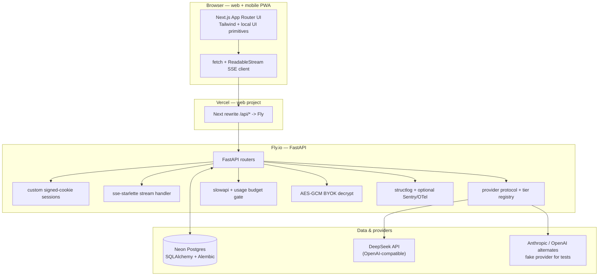

# PRD 04 — Technical Architecture

**Product:** A transparent, multi-model, cost-leading AI chat for web and mobile (mobile-web first).
**Primary persona (MVP):** Power users / developers. Secondary: privacy-conscious prosumers.
**Document type:** Engineering requirements / technical design (the buildable spec).
**Status:** Draft for build. Fast-moving facts are tagged **[confirm at build]**.
**Date:** 2026-05-27.

> **Priority tags:** **[P0/MVP]** = required to ship the MVP. **[P1]** = fast-follow, design for it now. **[P2]** = later / explicitly deferred.
> **Confidence:** facts the team must re-verify before locking implementation are marked **[confirm at build]** (e.g., exact Vercel max-duration). Contested compliance dates carry an explicit **[VERIFY]** flag requiring legal sign-off.

---

## 1. Summary & purpose

This document converts the architecture research into a buildable engineering spec for the MVP and the immediate fast-follow. It defines the stack per layer, the streaming/resumability design, the data model, the provider-abstraction and BYOK security model, file uploads, cross-cutting concerns (rate limiting, jobs, observability), the security/privacy non-functional requirements, and the deployment/portability strategy.

**Implementation note:** the original PRD investigated a Vercel-native AI SDK / Better Auth / Drizzle / Upstash architecture. The shipped implementation is now the source of truth: Next.js FE on Vercel, same-origin `/api/*` rewrite to a FastAPI backend on Fly, SQLAlchemy/Alembic on Neon Postgres, custom signed-cookie anonymous sessions, DeepSeek via an OpenAI-compatible adapter, optional Anthropic/OpenAI backends, slowapi, and optional Sentry/OpenTelemetry. Historical Vercel-native references below are retained only as design context where explicitly marked.

The guiding principle is **MVP-fast-but-not-cornered**: pick pragmatic hosted defaults to ship quickly, but place every external dependency (provider, storage, auth, queue, cache, tracing) behind a thin adapter so a later move to a different host, gateway, or provider layer is a *migration, not a rewrite*.

Three product constraints drive the architecture and are non-negotiable across all PRDs:
1. **Multi-provider model support from day one** via a thin provider-abstraction layer.
2. **Per-message transparency** — the data model captures the model used *and* token/cost usage *per message*.
3. **Privacy-first** — no-train-by-default, short configurable retention, one-click export/delete, and **guest/anonymous sessions** (chat before sign-up, then upgrade/link account).

---

## 2. Goals & non-goals (technical)

### Goals
- Ship a hosted, streaming, multi-model chat MVP with a TypeScript frontend, Python backend, and the smallest viable service count.
- Make model choice, per-message model attribution, and per-message token/cost a **first-class part of the data model**, not an afterthought.
- Support **guest sessions** with seamless upgrade/linking to a real account, with no data loss on upgrade.
- Survive process restarts and network drops for long AI streams; resumable replay is feature-flagged and designed for shared storage later.
- Keep COGS controllable: rate-limit by user *and* IP (for guests), route work off the request path, and support BYOK.
- Keep the whole stack portable behind adapters; avoid one-way doors.
- Meet baseline security/privacy NFRs (encryption, key handling, no-train default, export/delete, AI-interaction disclosure).

### Non-goals (MVP)
- **[P2]** Native mobile apps — mobile is responsive web / PWA for MVP (see PRD 03).
- **[P2]** True live multi-device sync via WebSockets — defer; resumable streams + refetch first.
- **[P2]** RAG / document chat ingestion pipeline — schema reserves space (pgvector) but it is not built day-1.
- **[P2]** Voice (STT/TTS) — would pull WebSockets/Durable Objects forward; out of MVP scope.
- **[P2]** Self-hosted gateway (LiteLLM), SSO/SAML, SOC 2 audit — designed-for, not built for MVP.
- **[P2]** A separate vector DB (Pinecone) — only at large scale.

---

## 3. Architecture overview + reference diagram

The shipped system is a **Next.js 16** App Router web app (responsive PWA for mobile) deployed on Vercel. Browser code calls same-origin `/api/*`; `web/next.config.ts` rewrites those requests server-side to the **FastAPI** backend on Fly so the backend's `Set-Cookie` lands first-party on the Vercel origin. The backend owns auth, persistence, provider routing, SSE streaming, BYOK, usage/cost attribution, rate limiting, account export/delete, and public share reads.

Postgres on Neon is the system of record. The backend uses SQLAlchemy 2.0 async + Alembic, Pydantic camelCase wire models, `sse-starlette`, slowapi, structlog, optional Sentry, optional OpenTelemetry, and an internal provider protocol with DeepSeek/OpenAI-compatible, Anthropic, and fake adapters. Resumable-stream replay is default-off and currently in-process; a production multi-worker version needs shared replay/stop coordination (Redis or equivalent).



ASCII fallback:

```
Browser (Next.js PWA)
  | same-origin /api/* (or direct CORS in local/e2e)
  v
Vercel rewrite -> Fly FastAPI
  | auth | rate-limit | BYOK decrypt | SSE stream | account/share routes
  v
Neon Postgres (SQLAlchemy/Alembic)
  |
  +--> DeepSeek via OpenAI-compatible adapter
  +--> Anthropic/OpenAI alternates, fake provider in tests
  +--> optional Sentry / OpenTelemetry
```

---

## 4. Stack decision table

| Layer | Choice (MVP) | Rationale | Main tradeoff | Alternative (when) |
|---|---|---|---|---|
| **Frontend** | **Next.js 16** App Router + Tailwind/local UI primitives; responsive **PWA** for mobile | Current shipped FE; Vercel hosting gives simple previews/prod deploys and same-origin rewrite support | App Router conventions and build-time env behavior must be respected | React Router / SvelteKit only if team rejects App Router |
| **Backend** | **FastAPI** on Fly.io, Python 3.11, `uv`, `sse-starlette` | Long-lived streaming process, clean Python provider SDKs, simple Docker deploy | Separate service from FE; CORS/rewrite/cookie details are load-bearing | Other container hosts if Fly constraints bite |
| **Transport** | **SSE** over `fetch` + `ReadableStream`; `EventSourceResponse` server-side | Credentialed POST body support; same parser works for direct CORS and same-origin rewrite | No bidirectional channel; stop/reconnect coordination is in-process today | WebSockets only if voice/collab requires it |
| **Provider layer** | Internal Python `Provider` protocol; DeepSeek via OpenAI-compatible adapter as canonical; Anthropic/OpenAI/fake alternates | Keeps provider/model/pricing behind backend registry; supports BYOK per provider id | Broader gateway/fallback breadth still future | LiteLLM/OpenRouter/gateway as P1/P2 breadth layer |
| **Database** | **Neon Postgres + SQLAlchemy 2.0 async + Alembic** | SQL control, async driver, migrations, SQLite-compatible tests | Hand-kept Pydantic/TS schema drift | OpenAPI codegen when drift hurts |
| **Cache / Redis** | None required for current MVP; in-process registries for temp IDs/stop/replay/rate-limit | Simpler single-worker MVP | Multi-worker resumable/stop/rate-limit needs shared storage | Redis/Upstash when multi-worker or resumable replay graduates |
| **Background jobs** | In-process detached tasks and lifespan reaper | Enough for title autogen and stale-stream cleanup in a single process | Hard crashes skip work; no durable retries | Dedicated worker/queue for attachments, embeddings, durable reapers |
| **Auth** | Custom signed-cookie sessions, anonymous-first users, in-place upgrade, login handoff | Minimal and proven in this repo; preserves guest data on upgrade | We own all auth flows and password policy | Better Auth/Supabase only if the product needs their feature set |
| **Object storage** *(P1 — lands with attachments)* | Not built | P0 is text-only | Attachments require storage, virus/abuse checks, and async processing | R2/S3/Vercel Blob behind adapter |
| **Secrets / BYOK** | AES-GCM ciphertext in DB with env KEK and versioned KEK registry | Simple deployable encryption at rest; prod refuses dev KEK | KMS envelope encryption is future hardening | Cloud KMS before larger public exposure |
| **Observability** | structlog request IDs; optional Sentry and OpenTelemetry | Low-cost visibility without requiring telemetry backend | No product analytics/metrics dashboard yet | Any OTel-compatible APM; Langfuse-style LLM tracing later |
| **Deploy** | **Vercel FE + Fly API + Neon DB** | Matches current prod; FE rewrite keeps cookies first-party | Split deploy and secrets across platforms | Consolidate only if operational cost outweighs benefits |

**One-line summary:** Next.js on Vercel rewrites `/api/*` to a FastAPI service on Fly; FastAPI streams via SSE, persists to Neon through SQLAlchemy/Alembic, and calls DeepSeek/Anthropic/OpenAI through backend adapters.

---

## 5. Detailed requirements by area

### 5.1 Streaming & resumable streams

- **[P0/MVP]** Default transport is **SSE** from FastAPI via `sse-starlette`, consumed by the Next.js client with `fetch` + `ReadableStream`. Browser calls are same-origin in production through the Next rewrite; local/e2e can call the backend directly with CORS. Token-by-token streaming is the core UX requirement (TTFT is a tracked metric — see PRD 05 §7). SSE caveats still apply: HTTP/1.1 caps concurrent SSE connections per browser/domain, and proxy/CDN buffering can defeat token streaming — the backend must set no-buffering headers / keep-alives.
- **[P0/MVP]** The streaming route runs on the Fly-hosted FastAPI backend, not a Vercel function. Fly still has machine lifecycle and deploy-interruption realities, so every stream must persist enough state for reload recovery and should avoid unbounded work in the request path.
- **[P0/MVP] Stop / abort semantics:** user Stop is a **dedicated server-side stop endpoint** (`POST /api/conversations/:id/stop`). The backend records durable stop intent on the active `stream` row and signals the in-process generator through `stop_registry`; the generator polls the signal between provider chunks and persists the assistant turn as `stopped`. A browser disconnect also tears down the turn as `stopped` in the current single-process MVP.
- **[P0/MVP] Interrupted-stream UX:** network drops, server errors, user Stop, and deploy interruption all end with a persisted partial assistant message in `message.parts` and `stream.status = stopped | error`. PRD 01/03 own the surface: inline **Continue** (submit continuation context as a new turn) and **Regenerate** (re-run last user message). *AC:* partial tokens survive reload; Continue/Regenerate never silently discard partial content.
- **[P0/MVP] Reconnect/replay:** `GET /api/conversations/:id/stream/:stream_id` replays from the in-process replay buffer and then tails the live producer. This is best-effort and scoped to the current process: a browser refresh on the same live backend can recover buffered events, but a process restart or multi-worker deployment requires a shared replay store.
- **[P1] Resumable streams:** move replay and stop signaling from in-process registries to shared storage (Redis or equivalent). The `stream` row remains the source of truth for run state (`active | done | stopped | error`), while shared replay storage handles cross-worker reconnect and shared stop signaling handles cross-worker cancel. On a concurrent send to a chat that already has an active stream, return `409` + "a response is already generating in this chat."
- **[P0/MVP] Long-stream constraint:** do not assume streams can run indefinitely. Layered mitigations: (1) persist partial output and stream rows as chunks arrive, (2) support explicit stop and best-effort replay, (3) keep heavyweight non-token work such as file processing, embeddings, and durable title generation off the request path when those features land. Durable workflow engines remain a P1/P2 option for multi-minute agent loops.
- **[P0/MVP] Client error contract:** wire streaming failures through the frontend SSE client and show recoverable error state in the assistant bubble/footer. Preserve partial `message.parts` on error. Emit one terminal analytics/observability event per assistant turn from backend terminal handling: `done` | `stopped` | `error`, with `conversation_id`, `message_id`, `requested_model_id`, `served_model_id`, and token/cost snapshot when available.
- **[P0/MVP] Message-send idempotency key (billing-consistency, OWASP LLM10):** the client generates a **`client_message_id` (UUID v4)** per user send intent and includes it in the message-send payload. Because `message.cost_usd` (§6) is the live billing ledger, a single user intent must never spawn duplicate assistant turns under network retries, double-clicks, optimistic-send replays, or Regenerate. The backend dedupes on `client_message_id` before any provider call or ledger write; a duplicate returns the existing turn / its in-progress stream, never a second generation. Stored as `message.client_message_id`, unique per chat (§6). *AC:* replaying the same `client_message_id` to a chat produces at most one assistant turn and at most one ledger write — no double-charge.
- **[P0/MVP] Billing-vs-stream-failure atomicity (order-of-operations):** define exactly **when** `cost_usd` / `usage_rollup` is written relative to a stream that may complete, stop, error, or be interrupted — to avoid bill-for-nothing (charge then stream dies) and stream-for-free (tokens consumed, never metered):
  - **Capture** provider usage from backend provider-stream terminal handling, covering the terminal states the §5.1 client error contract emits — `done` | `stopped` | `error`.
  - **Write** the cost ledger (`message.cost_usd` + `cost_breakdown`, `usage_rollup`) in the **same transaction/step** that finalizes the `message` + `stream` row — never as a separate, unguarded write.
  - **Meter partial usage on abort:** provider-reported tokens on a stopped/interrupted run are still metered (the persisted partial `message.parts` carries a real, billable cost); a run that never produced billable usage writes zero.
  - **Reconcile** orphaned runs via the backend reaper (§5.1): a stale active `Stream` row is marked stopped/error and reconciled from the last captured usage so no run is left unmetered or double-metered.
  *AC:* every terminal state writes exactly one ledger entry atomic with message+stream finalization; a stream that dies mid-flight meters only the provider-reported partial usage; reaper-reaped orphans are metered exactly once.

### 5.2 Provider abstraction & BYOK

- **[P0/MVP] Thin provider adapter:** all model calls go through the backend's internal provider protocol. App code references stable tier/model ids; adapter implementations own provider-specific SDKs, base URLs, streaming deltas, usage extraction, pricing inputs, and BYOK client construction. Swapping DeepSeek/OpenAI-compatible routing for LiteLLM, OpenRouter, or a gateway must not touch route handlers or UI call sites.
- **[P0/MVP] Structured outputs / schema validation:** the MVP reserves structured-output contracts behind provider capabilities and Pydantic/JSON-schema validation. Do not bind product code to a frontend SDK-specific structured-output API; keep schema validation at the backend/provider boundary.
- **[P1] Tool/agent loop:** tool execution, HITL approval, and multi-step agents stay behind the provider/agent adapter. The P0 message schema already accepts tool-call/status parts; the execution engine can be OpenAI-compatible tools, Anthropic tools, a workflow engine, or another adapter without changing the chat data model.
- **[P0/MVP] Multi-provider from day one:** the **main provider is DeepSeek** (the cost-leading default for free-tier / casual queries; PRD 02/05 own the registry), with OpenAI, Anthropic, and Google as selectable picker routes / alternate backends (see PRD 05 §3; PRD 02 §5.3 owns the model-selection rule).
- **Current implementation (MVP deploy):** the deployed BE binds the OpenAI-compatible adapter to the DeepSeek-hosted API as the main provider. Config today: `PROVIDER_BACKEND=deepseek` (pinned in `api/fly.toml`), `https://api.deepseek.com` as the built-in base URL, and canonical tier bindings in `api/app/providers/tiers.py`: auto/fast/smart use `deepseek-v4-flash`, and pro uses `deepseek-v4-pro`. Production DeepSeek no longer depends on `OPENAI_BASE_URL` or per-tier `OPENAI_MODEL_*` overrides. This matches the main-provider/default decision in **PRD 00 §11 D11** and the model-selection rule in PRD 02 §5.3.
- **[P0/MVP] Per-message model + usage capture:** every assistant message records the resolved `model_id`, `provider`, and token usage (prompt/completion/total) and a computed cost. The cost field must be able to represent **effective/tiered cost** (cached-input, threshold/long-context multipliers, promos), not just a single scalar — **PRD 02 owns the pricing schema** that produces these multipliers, **PRD 01 owns the display**, this PRD owns the **storage/capture** shape (§6). This powers the transparency UX (model used + token cost per message), unit-economics metrics, **and** the live budget-enforcement signal (§5.6). **This is a hard cross-PRD contract.**
- **[P0/MVP] BYOK key security:**
  - Encrypt user-supplied keys at rest with AES-GCM using the environment KEK / versioned KEK registry, with a future path to KMS envelope encryption. Store only ciphertext in `api_key.encrypted_key`.
  - **Never log keys**; redact in error traces; never place keys in system prompts (OWASP LLM system-prompt-leakage risk).
  - Scope keys per user; decrypt only in-process at call time; never return plaintext to the client.
  - Use a fresh AES-GCM nonce per encryption, store unique `(user_id, provider)`, track `last_used_at`/`updated_at`, and support **soft-delete/revocation/rotation** (§6 `api_key`). Per-record DEKs wrapped by KMS are the future hardening path, not the shipped mechanism.
- **[P0/MVP] Guest + BYOK policy:** **BYOK requires a non-anonymous account.** A guest gets a real `user` row (FK works) but its identity is evictable and may never upgrade — storing a provider key against it is a key-security/abuse hazard. Gate key entry on a real account.
- **[P0/MVP] BYOK UI gate:** hide key-entry controls and block `api_key` writes when `user.is_anonymous = true`; show upgrade-to-link-account CTA (PRD 01 §4.8).
- **[P0/MVP] Grok registry gating:** registry seed may include xAI/Grok through a future breadth layer, but set `default_route_eligible = false` until `data_policy` review passes PR-1. Auto-routing and free-tier defaults MUST NOT select Grok.
- **[P0/MVP] Platform-keys vs BYOK policy:** platform keys = we pay, we meter and rate-limit (default for free/Pro tiers); BYOK = user pays, we proxy with no token markup. Metering/limits apply to platform-key usage; BYOK usage is still rate-limited for abuse but not metered for billing.
- **[P1] Provider drift handling:** model ids and capabilities (tools, vision, reasoning) move fast — keep a capability registry per model so the UI can gate features (e.g. vision-only models) and the adapter can fall back.

### 5.3 Data model — see §6 for the full draft schema

- **[P0/MVP]** Postgres + SQLAlchemy/Alembic is the system of record. Client state is a cache; the DB is authoritative.
- **[P0/MVP]** Required tables for MVP: `user` (with `is_anonymous`), `chat` (with `visibility` + `model_id`), `message` (**typed multi-part `parts`** + attachments jsonb + per-message model + token + effective/tiered cost), `stream`, `vote`, **`api_key` (BYOK — P0 per the launch-BYOK decision)**.
- **[P0/MVP] Typed multi-part message model (THIS PRD owns the data-model schema):** a `message` is an **ordered list of typed parts** — `text | reasoning | tool-call | tool-result | citation | interactive-block` — not a single markdown string. Modeling this in the P0 data layer (even if P0 only *renders* the text/reasoning/code subset) de-risks tools, structured citations, interactive viz, and generative UI in one move; skipping it guarantees a P1 refactor. **PRD 01 references this for rendering** (the rendering decision is really a data-model decision and is made here once).
- **[P0/MVP] `tool-call` part shape (schema now, minimal renderer):** even before tools ship (P1), `message.parts` MUST accept persistable tool/status parts so PRD 01 status lines are not throwaway. Minimum fields: `type: 'tool-call'`, stable `id`, `toolName` or `displayLabel`, `status: 'pending' | 'running' | 'completed' | 'failed' | 'denied'`, nullable `input`/`output` jsonb, nullable `error`, optional `startedAt`/`completedAt`. P0 UI may render these as status lines only; expandable tool UI is P1.
- **[P1]** `attachment` (file upload lands with vision/PDF understanding), `document` + `suggestion` (artifacts).
- **[P2]** `embedding` (RAG, pgvector) — reserve the design, do not build.

### 5.4 Storage & file uploads

> **Phase note:** file attachments are **P1** (they land with vision/PDF understanding — see PRD 02 §4.8). The lean text-core MVP ships no upload flow; this section is the **P1** design (build the adapter interface when attachments land, not before).
> **P0 rule:** do not ship presigned upload, `attachment` writes, or mobile attach UI in P0. Attach affordances land with P1 vision/PDF.

- **[P1] Presigned direct-to-storage upload:** client requests a presigned PUT URL from our API → browser uploads **directly** to object storage (keeps large files off function compute/timeout budget) → API writes the `attachment` row with object URL + metadata.
- **[P1] Validation:** server issues presigned URLs only for allowed content-types and a max size; verify object existence + size after upload before marking `ready`.
- **[P1] Async processing via queue/worker:** thumbnailing/resize, PDF/text extraction (for future RAG), and virus/abuse scanning run out of band, never inline. The queue can be a dedicated worker, QStash, or another durable job runner behind an adapter. `attachment.status` transitions `uploaded → processing → ready | failed`.
- **[P1] Storage adapter:** wrap R2/Blob/S3 behind one interface so R2 ↔ Blob ↔ S3 swaps are config, not code.

### 5.5 Auth & guest sessions

- **[P0/MVP] Guest/anonymous sessions are a hard requirement.** A first-time visitor can start chatting with **no sign-up**. The anonymous user gets a real `user` row with `is_anonymous = true`.
- **[P0/MVP] Upgrade / link:** on sign-up or login, the anonymous account is upgraded in place with **no chat loss**. The current implementation uses custom signed-cookie sessions, argon2id password auth, and a login handoff cookie; any future auth provider must preserve this anonymous→linked contract.
- **[P0/MVP] Guest cost control:** guests are rate-limited by **IP** (and by anonymous user id) to cap model spend — see §5.6.
- **[P1]** Passkeys / 2FA, organizations / RBAC — enable as team features mature, either in the custom auth layer or by migrating behind the auth boundary.
- **[P2]** SSO / SAML for teams (later — see §5.7).
- **Decision note:** custom auth is the shipped implementation. Better Auth or Supabase Auth remain migration options only if their team/enterprise features justify the cost; they must be evaluated against data migration, password/session migration, and anonymous-upgrade preservation.

### 5.6 Rate limiting, jobs & observability

- **[P0/MVP] Rate limiting — token + cost-budget aware, not request-count-only (OWASP LLM10 Unbounded Consumption):** the shipped baseline uses slowapi request limits plus a best-effort `USAGE_BUDGET_USD` gate enforced from the usage/cost ledger. A request-count window bounds request *rate*, not token/$ *spend* — one request can be 200k tokens, which is the real "inference whale" exposure (PRD 05 §3; §8 Risk #5).
  - **(a) shipped request-rate limits** per route bucket, with guest controls by IP/session where available.
  - **(b) shipped cost-budget caps** enforced off the usage ledger / `message.cost_usd` signal, especially for guests/free tier.
  - **(c) P1 shared limiter** for multi-worker deployments: token-window limits, weighted limits by model cost class, and a circuit breaker for runaway tool/agent loops.
  Return `429` with retry-after and surface a clear UI state. **Budget/metering hook (cross-PRD):** this limiter is also the enforcement mechanism for the P0 metered-overage/credit primitive PRD 05 is adopting. **PRD 05 owns the monetization/credit decision; this PRD owns enforcement.** ([genai.owasp.org LLM10 Unbounded Consumption](https://genai.owasp.org/llmrisk/llm102025-unbounded-consumption/), [zuplo token-based rate limiting](https://zuplo.com/learning-center/token-based-rate-limiting-ai-agents).)
- **[P0/MVP] Caching/state:** sessions and durable chat state live in Postgres; per-process registries handle temporary ids, replay buffers, stop signals, and limiter state. Shared Redis/Upstash becomes a requirement when replay, stop, rate limiting, or hot-read caching must work across multiple workers.
- **[P1] Background jobs:** attachment processing, embeddings, durable title generation, webhooks, and stream reaping move to an idempotent queue/worker with retries and dead-letter handling. Current title/reaper behavior is in-process and acceptable only for the single-process MVP.
- **[P0/MVP] Observability / tracing:** emit structured logs with request IDs and model/usage/cost fields. Optional Sentry captures exceptions and optional OpenTelemetry exports traces. Track TTFT and full-response latency per model (PRD 05 §7 KPI). Langfuse-style LLM tracing is a future observability backend, not a shipped dependency.
- **[P0/MVP] Error handling:** distinguish stream errors, provider errors (rate-limit/quota/timeout), and app errors; log with key redaction; design idempotent retries for future jobs.

### 5.7 Security & privacy NFRs

- **[P0/MVP] Encryption:** TLS in transit everywhere; encryption at rest for DB and object storage; BYOK keys encrypted with the app KEK/versioned KEK registry (§5.2), with KMS envelope encryption as the hardening path.
- **[P0/MVP] No-train-by-default — provider DPAs / no-train API modes are the PRIMARY control:** never send user chats to providers for training; the no-train wedge rests primarily on choosing provider API modes / DPAs that prohibit training on our traffic. Surface retention status in-product. Gateway ZDR can be a future defense-in-depth layer if the provider mix moves through a gateway, but it is not the baseline guarantee.
- **[P0/MVP] Retention controls + export/delete — cross-store cascade (GDPR-complete, not Postgres-only):** short, **configurable retention**; one-click **export** (user's chats/messages) and **delete**. The shipped export/delete routes cover Postgres-owned user data. When attachments, shared replay storage, and third-party trace backends are added, delete/retention must fan out across every store that can hold PII via an idempotent delete job with documented per-store TTLs:
  - **Object storage (R2/Blob/S3):** delete the user's attachment objects (otherwise orphaned after the row delete).
  - **Shared replay/cache storage:** purge buffered resumable-stream data and cached reads (keys scoped per user/chat).
  - **Observability traces:** **traces are a PII store** if they contain prompt/response content, so they are in scope for export/delete or must be configured for retention/no-content capture.
  - **Gateway/provider logs:** provider DPAs/no-train modes are the primary control; any gateway must document retention/ZDR behavior separately.
  This is the product's core privacy wedge and a GDPR requirement.
- **[P0/MVP — UNCONDITIONAL] AI-interaction disclosure (EU AI Act Article 50(1) transparency):** the interaction-disclosure duty is **FIRM at 2 Aug 2026** (unchanged by the 7-May-2026 Digital Omnibus). A persistent UI affordance/flag disclosing the user is interacting with AI. **Build the disclosure hook (a disclosure flag in the chat UI + response metadata) as an unconditional P0 — it is NOT contingent on the content-marking debate** and is needed regardless of EU outcome (US disclosure gates apply too; PRD 05 owns). This is a firm date, not a `[confirm at build]` item.
- **[VERIFY — LEGALLY UNSETTLED COMPLIANCE DATE; NEEDS LEGAL SIGN-OFF BEFORE EU-LAUNCH SCOPE IS LOCKED] AI-content marking (EU AI Act Article 50(2), machine-readable marking of AI-generated content):** the binding date is **legally unsettled for a new launch** following the **7-May-2026 Digital Omnibus** (a Council/Parliament provisional agreement that is **provisional pending Official Journal publication**). **Do not pick a single marking date** — readings range from an **architecture read (~2 Dec 2026)** to a **compliance read (no grace for a new product → binds 2 Aug 2026)**. This is a legal call, **coordinated with PRD 05** so the two PRDs agree (neither PRD asserts one date unilaterally).
  - **What is settled:** marking only attaches **if/when we ship AI-generated media**. For a P0 text-relay chat with attribution it is narrow either way; image/media generation is P2.
  - **Resolution path:** **legal sign-off is required before EU-launch scope is locked** (tracked in §9 Q1). If marking is in scope, Article 50(2) wants the marking embedded in the **output/exported artifact** (C2PA-style content credentials for images, watermark/metadata for text/exports) — **not just the `ai_generated` DB boolean.**
  - **Keep the `[VERIFY]` flag; do not downgrade.** The schema hooks (`message.ai_generated`, `document.ai_generated`) stand either way; if marking goes P0, add an explicit **output-embedded marking** requirement for exports and any P2 image/media generation.
- **[P1] Prompt-injection mitigation (OWASP LLM Top 10, 2025 — LLM01 prompt injection, LLM07 system-prompt leakage):** clearly segregate/mark untrusted content (tool outputs, file contents, web results) from instructions; constrain model role/tools; validate inputs; run prompt-injection / system-prompt-leakage tests in CI. Becomes P0 the moment tools/RAG/web-browsing land. Also in scope: **LLM10 Unbounded Consumption** (the cost/abuse exposure — enforced in §5.6) and **LLM08 Vector & Embedding Weaknesses** (matters once RAG/pgvector lands).
- **[P1] PII handling:** minimize data sent to models; provide a no-telemetry mode; scan inputs/outputs as tooling matures.
- **[P2] SSO / SAML** (team tier), **SOC 2** path (audit logs, access controls designed for it now), **DPA** availability — designed-for in MVP (audit-log table, RBAC), delivered later.

### 5.8 Deployment & portability

- **[P0/MVP]** Deploy the frontend on **Vercel** and the API on **Fly.io**, with Neon Postgres as the database. Browser calls use same-origin `/api/*`; Next rewrites those requests server-side to Fly so auth cookies stay first-party on the Vercel origin.
- **[P0/MVP] Portability by adapter:** provider, storage, auth, cache/queue, and tracing all stay behind thin interfaces. SQLAlchemy/Alembic keep the DB portable across Postgres hosts. The escape hatches are explicit: another container host for the API, Redis/shared workers for multi-process stream state, or Cloudflare/Durable Objects only if realtime/voice requirements justify that move.
- **[P0/MVP] Client storage is non-authoritative:** client-side PWA storage (IndexedDB / Cache API) is a **best-effort cache** only; Postgres is the system of record (offline UX: PRD 03 §4.6). **iOS correction:** Safari 17+ per-origin quota is **disk-proportional** via `navigator.storage.estimate()` — not ~50 MB. The binding constraint is **7-day ITP eviction** of non-persisted data unless `navigator.storage.persist()` is granted (more likely for installed PWAs). Request `persist()` at install/first-save; still re-hydrate from server on load. Never treat IndexedDB as authoritative for message history, BYOK keys, or billing.
- **[P2] Realtime multi-device sync:** deferred. **P0** uses server-persisted partials + Continue/Regenerate on interrupt (PRD 01/03). **P1** adds same-device resumable-stream replay (§5.1). True live multi-device push (SSE fan-out, Supabase Realtime, Durable Objects) is added only when prioritized. Chat is mostly append-only, so last-write-wins on metadata + ordered inserts suffices; no CRDT for MVP.

---

## 6. Data model (draft schema)

Aligned with the shipped SQLAlchemy/Alembic schema, with typed multi-part messages, per-message model/usage transparency, and BYOK. SQL-ish; `jsonb` where noted. UUID PKs unless stated.

```sql
-- USER --------------------------------------------------------------- [P0]
user (
  id            uuid pk,
  email         text null,              -- null for guests
  name          text null,
  is_anonymous  boolean not null default false,   -- guest sessions
  retention_days integer null,          -- per-user retention override
  custom_instructions text null,         -- P0 custom instructions injected into chats
  preferences   jsonb not null default '{}', -- theme, locale, a11y, future user prefs
  created_at    timestamptz not null,
  updated_at    timestamptz not null
)

-- CHAT --------------------------------------------------------------- [P0]
chat (
  id          uuid pk,
  user_id     uuid not null references user(id) on delete cascade,
  title       text,
  visibility  text not null default 'private',   -- private | public | unlisted
  model_id    text not null,            -- default/selected model for the chat
  is_temporary boolean not null default false, -- excludes future memory/personalization
  expires_at  timestamptz null,         -- optional shorter retention for temporary chats
  created_at  timestamptz not null,
  updated_at  timestamptz not null
)
-- index: (user_id, updated_at desc)

-- SHARE_LINK ---------------------------------------------------------- [P0]
share_link (
  id          uuid pk,
  chat_id     uuid not null references chat(id) on delete cascade,
  token_hash  text not null unique,     -- store hash only; raw token appears in URL
  created_at  timestamptz not null,
  revoked_at  timestamptz null
)
-- AC: revoked share links return 404; public share payload strips token/cost fields per PRD 07.

-- MESSAGE ------------------------------------------------------------ [P0]
-- "Message_v2" style: typed multi-part `parts` + attachments jsonb; per-message model + usage + effective cost
message (
  id            uuid pk,
  chat_id       uuid not null references chat(id) on delete cascade,
  client_message_id text null,          -- client-generated idempotency key (UUID v4); dedupe send
                                         --   BEFORE provider call + ledger write (§5.1 billing-consistency)
  role          text not null,          -- user | assistant | system | tool
  parts         jsonb not null,         -- ORDERED list of TYPED parts:
                                         --   { type: 'text'|'reasoning'|'tool-call'|'tool-result'
                                         --          |'citation'|'interactive-block', ... }
                                         --   P0 renders the text/reasoning/code subset; schema is full now
  attachments   jsonb not null default '[]',
  model_id          text null,          -- resolved/served model for assistant msgs  *** transparency contract
  provider          text null,          -- openai | anthropic | google | ...
  requested_model_id text null,         -- explicit model requested at send time, if any
  requested_tier     text null,         -- Fast | Smart | Pro | Auto
  served_model_id    text null,         -- explicit served model id; defaults to model_id
  routing_decision   jsonb null,        -- Auto/router signals + chosen route
  substitution_reason text null,        -- auto_downgrade|rate_limited|provider_fallback|deprecated_model|budget_cap|policy_route
  prompt_tokens     integer null,
  completion_tokens integer null,
  total_tokens      integer null,
  cost_usd          numeric(14,8) null, -- effective per-message cost; wide precision (cheap models <1e-6/msg)  *** transparency contract
  cost_breakdown    jsonb null,         -- EFFECTIVE/TIERED cost detail: cached-input, threshold/long-context
                                         --   multipliers, reasoning-token cost, promo — PRD 02 owns the PRICING
                                         --   SCHEMA that produces these; PRD 01 owns DISPLAY; this PRD owns CAPTURE
  is_byok       boolean not null default false,
  ai_generated  boolean not null default false,  -- EU AI Act content-marking hook (see §5.7 [VERIFY])
  created_at    timestamptz not null
)
-- index: (chat_id, created_at)
-- unique index: (chat_id, client_message_id) where client_message_id is not null
--   -- message-send idempotency: dedupe a send BEFORE any provider call / ledger write (§5.1)
-- cost_usd doubles as the live budget-enforcement signal for §5.6 (not just a display value)
-- billing-vs-stream-failure atomicity: cost_usd/cost_breakdown + usage_rollup are written in the SAME
--   transaction that finalizes message+stream, from backend provider terminal usage (§5.1)

-- USER_PLAN / USAGE --------------------------------------------------- [P0] (metered free + Pro + credits)
user_plan (
  user_id       uuid pk references user(id) on delete cascade,
  tier          text not null,          -- free | pro | byok_only | team_later
  period_start  timestamptz not null,
  period_end    timestamptz not null,
  message_cap   integer null,
  token_cap     integer null,
  usd_cap       numeric(14,8) null,
  usd_credits_remaining numeric(14,8) not null default 0
)

usage_rollup (
  user_id       uuid not null references user(id) on delete cascade,
  period_start  timestamptz not null,
  messages_used integer not null default 0,
  tokens_used   integer not null default 0,
  usd_spent_platform numeric(14,8) not null default 0, -- sums only message.is_byok = false
  primary key (user_id, period_start)
)
-- AC: budget exhaustion returns PRD 08 PLATFORM_BUDGET_EXCEEDED; BYOK turns do not decrement usd_spent_platform.

-- ATTACHMENT --------------------------------------------------------- [P1] (lands with vision/PDF)
attachment (
  id            uuid pk,
  message_id    uuid null references message(id) on delete set null,
  user_id       uuid not null references user(id) on delete cascade,
  url           text not null,          -- R2/Blob/S3 object url
  content_type  text not null,
  size_bytes    bigint not null,
  status        text not null default 'uploaded',  -- uploaded|processing|ready|failed
  created_at    timestamptz not null
)

-- STREAM (resumable-stream tracking) --------------------------------- [P0 schema, P1 replay]
stream (
  id          uuid pk,                  -- the resumable stream id
  chat_id     uuid not null references chat(id) on delete cascade,
  user_id     uuid not null references user(id) on delete cascade,
  message_id  uuid null references message(id),  -- the assistant msg being generated
  status      text not null default 'active',    -- active | done | aborted
  created_at  timestamptz not null,
  updated_at  timestamptz not null
)
-- unique partial index: (chat_id) where status = 'active'  -- at most one active stream per chat,
--   so the abort channel + reaper reconcile deterministically
-- reaper job marks stale 'active' rows 'aborted'

-- VOTE ("Vote_v2": one vote per message) ----------------------------- [P0]
vote (
  chat_id     uuid not null references chat(id) on delete cascade,
  message_id  uuid not null references message(id) on delete cascade,
  is_upvoted  boolean not null,
  primary key (chat_id, message_id)
)

-- DOCUMENT (AI artifacts, versioned) --------------------------------- [P1]
document (
  id            uuid not null,
  created_at    timestamptz not null,
  user_id       uuid not null references user(id) on delete cascade,
  title         text,
  kind          text not null,          -- text | code | image | sheet
  content       text,
  ai_generated  boolean not null default true,  -- content-marking hook
  primary key (id, created_at)          -- composite pk = versioning
)

-- SUGGESTION (edit suggestions on a Document) ------------------------ [P1]
suggestion (
  id                   uuid pk,
  document_id          uuid not null,
  document_created_at  timestamptz not null,
  original_text        text,
  suggested_text       text,
  resolved             boolean not null default false,
  foreign key (document_id, document_created_at)
    references document(id, created_at) on delete cascade
)

-- API_KEY (BYOK, encrypted) ------------------------------------------ [P0] (BYOK ships at launch)
api_key (
  id            uuid pk,
  user_id       uuid not null references user(id) on delete cascade,
  provider      text not null,          -- openai | anthropic | google | ...
  encrypted_key bytea not null,         -- envelope-encrypted (fresh DEK per record, AES-256-GCM); NEVER logged
  key_hint      text null,              -- last-4 for UI only
  last_used_at  timestamptz null,       -- usage/rotation visibility
  deleted_at    timestamptz null,       -- soft-delete (revocation) — keep history, exclude active
  created_at    timestamptz not null,
  updated_at    timestamptz not null
)
-- unique index: (user_id, provider) where deleted_at is null  -- one active key per provider per user
-- BYOK policy: require a NON-ANONYMOUS account to store a key (guest identities are evictable; see §5.2/§5.5)

-- EMBEDDING (future RAG, pgvector) ----------------------------------- [P2]
-- CREATE EXTENSION vector;
embedding (
  id          uuid pk,
  document_id uuid not null,
  chunk       text not null,
  embedding   vector(1536),             -- dim per embedding model [confirm at build]
  created_at  timestamptz not null
)
-- ivfflat/hnsw index added when RAG is built

-- AUDIT_LOG (SOC 2 / security hook) ---------------------------------- [P1 design, P2 enforce]
audit_log (
  id          uuid pk,
  user_id     uuid null,
  action      text not null,            -- login, export, delete, key_add, ...
  metadata    jsonb,
  created_at  timestamptz not null
)
```

**Cross-PRD contract (must be respected):** `message` carries `model_id`, `provider`, token counts, and `cost_usd` per message; `message.client_message_id` (unique-per-chat) is the message-send idempotency key that protects the `cost_usd` ledger from double-charge (§5.1); `user.is_anonymous` enables guest sessions; `ai_generated` on `message`/`document` is the EU AI Act content-marking hook.

---

## 7. Dependencies & cross-references

- **PRD 01 — Core Chat Experience** (chat UI): the transparency UX (model used + token cost per message) consumes `message.model_id` / `provider` / requested-vs-served fields / `cost_usd` / `cost_breakdown`; **PRD 01 owns the display** of effective/tiered cost; the **typed multi-part `message.parts`** model (this PRD, §5.3/§6) is what PRD 01 renders (text/reasoning/code at P0); artifacts UX consumes `document`/`suggestion`; vote UX consumes `vote`; the streaming/stop UI sits on §5.1; conversation search reads the chat/message store.
- **PRD 02 — AI Capabilities** (model registry / AI contracts): defines the model catalog, capability flags (vision/tools/reasoning), routing policy, reasoning/usage semantics, and the cheap-default-model strategy that this PRD's provider adapter + capability registry (§5.2) implement. **PRD 02 owns the pricing schema** (tiered/threshold/cached/promo multipliers) that produces the effective cost; this PRD owns the **storage/capture** shape (`message.cost_usd` + `cost_breakdown`, §6) — the data-layer counterpart of PRD 02's transparency contract.
- **PRD 03 — Mobile & Cross-Platform** (mobile/PWA UX): mobile is responsive web / PWA — no separate mobile framework. This PRD owns the service-worker / IndexedDB / sync internals, object storage, and the AI-data-disclosure consent plumbing that PRD 03's UX requirements depend on; streaming and a11y (live-region token announcements, touch targets) must hold on mobile web.
- **PRD 05 — Roadmap / Monetization / Metrics**: §5.7 NFRs implement PRD 05's product-level privacy/compliance policy; the rate-limiting + BYOK design (§5.2/§5.6) implements PRD 05's metered-free-tier + model-routing economics. **Cross-PRD boundary:** **PRD 05 owns the metered-overage / credit (monetization) decision; this PRD owns the enforcement mechanism** — the token + cost-budget caps + circuit breakers (§5.6), with `message.cost_usd` (§6) as the live spend ledger and the metering hook PRD 05 reads. **Phase changes for the PRD 05 roadmap worker:** (a) EU AI Act content-marking may move **P1 → P0** pending legal sign-off (§5.7/§9 Q1) — flag, do not lock; (b) the resumable-stream **stop endpoint + orphaned-run handling is now the PRIMARY P0(-with-resumable)/P1 stop path** (§5.1), not an edge case; (c) **Vercel Workflows / DurableAgent** is the P1 agent-loop / long-run horizon. Observability (§5.6) emits the TTFT / cost-per-message signals PRD 05's KPIs consume.

---

## 8. Top architectural risks & mitigations

| # | Risk | Impact | Mitigation |
|---|---|---|---|
| 1 | **Long streams vs process/deploy interruption** | Agentic/multi-step responses outlast a request, deploy, or machine lifecycle; dropped streams | Persist partial messages + stream rows, support explicit stop, run a stale-stream reaper, and graduate replay/stop state to shared storage before multi-worker resumability |
| 2 | **Vendor lock-in / cost cliffs** | Split hosting plus provider APIs can create migration pain and cost cliffs | Thin adapters (provider/storage/auth/cache/queue/tracing); self-ownable defaults (SQLAlchemy/Alembic, custom auth, OTel); keep Fly/Vercel/Neon-specific assumptions in config and ops docs |
| 3 | **Provider drift** | Model ids, pricing, capabilities, usage semantics, and reasoning modes move fast | Isolate provider SDKs behind the backend protocol; maintain a tier/capability/pricing registry; pin Python/JS dependencies with lockfiles; gate provider/model changes through tests and docs |
| 4 | **BYOK key security** | Key leakage = direct financial + trust damage | AES-GCM with versioned KEK today, KMS envelope encryption as future hardening, per-user scoping, never log, never in system prompts, redact in traces; store only last-4 hint for UI |
| 5 | **Guest-traffic cost** | Free/anonymous users can run up model spend (inference-whale risk, PRD 05 §3) | Rate-limit by user AND IP where available; use cheap default models for guests; enforce cost budgets from the usage ledger; add weighted token limits before agent/tool expansion |

---

## 9. Open questions / spikes

1. **[VERIFY — LEGAL SIGN-OFF REQUIRED] EU AI Act content-marking date (§5.7).** Interaction-disclosure (Art. 50(1)) is **FIRM at 2 Aug 2026** → the disclosure hook is an **unconditional P0**, not contingent on this question. Content-marking (Art. 50(2)) is **legally unsettled for a new launch** after the **7-May-2026 Digital Omnibus** (provisional pending Official Journal): readings range from an architecture read (~2 Dec 2026) to a compliance read (no grace → 2 Aug 2026). **Do not pick one** — marking only attaches **if/when we ship AI-generated media** (image/media gen is P2), and the date needs **legal sign-off before EU-launch scope is locked**. **Coordinated with PRD 05 so the two PRDs agree; not decidable inside either PRD unilaterally. Do NOT downgrade the `[VERIFY]` flag.**
2. **Postgres host** — Neon vs Supabase Postgres (branching vs bundled auth/storage/realtime + RLS). Note: Neon (now Databricks-owned, runs independently) cut pricing materially in 2026, shifting economics toward Neon.
3. **Multi-worker stream state** — decide when usage/load justifies shared replay, shared stop signaling, and shared rate-limit storage instead of the current single-process registries.
4. **RAG in MVP?** — determines whether pgvector + an ingestion pipeline (LlamaIndex.TS / hand-rolled) is day-1 or deferred (currently P2). pgvector 0.8 iterative scan improves filtered/per-user-RAG recall when this lands.
5. **Voice scope** — STT/TTS would pull WebSockets/Durable Objects forward and change the transport decision; confirm out-of-scope for MVP.
6. **Realtime multi-device sync priority** — confirm deferred (resumable streams + refetch) vs build SSE fan-out / Supabase Realtime / Durable Objects.

**Resolved by the fresh-research + PRD-review pass:**
- ~~**Frontend-only Vercel-native backend architecture.**~~ **Superseded by shipped split architecture:** Next.js FE on Vercel, FastAPI API on Fly, Neon Postgres, same-origin rewrite for cookies.
- ~~**Auth choice for MVP.**~~ **Resolved → custom signed-cookie anonymous-first auth**, with argon2id password upgrade/login and an explicit future migration boundary.
- ~~**BYOK policy at launch.**~~ **Resolved → user BYOK day-1 (P0)**, gated to **non-anonymous accounts**; platform keys metered, BYOK proxied zero-markup (§5.2).

---

## 10. References

Key source URLs (re-verify fast-moving facts at build):
- Next.js 16 and Vercel FE hosting — https://nextjs.org/blog/next-16
- FastAPI / SSE / Fly runtime docs — https://fastapi.tiangolo.com/ , https://fly.io/docs/
- Provider gateway and BYOK alternatives for future breadth layers — https://vercel.com/ai-gateway , https://openrouter.ai/announcements/bring-your-own-api-keys , https://www.edenai.co/post/best-alternatives-to-litellm
- Rate limiting / OWASP LLM10 Unbounded Consumption — https://zuplo.com/learning-center/token-based-rate-limiting-ai-agents , https://genai.owasp.org/llmrisk/llm102025-unbounded-consumption/
- EU AI Act Article 50 transparency — https://artificialintelligenceact.eu/article/50/ , https://digital-strategy.ec.europa.eu/en/policies/code-practice-ai-generated-content
- pgvector 0.8 (iterative scan) — https://supabase.com/blog/pgvector-vs-pinecone
- Resumable stream design references — https://github.com/vercel/resumable-stream
- Streaming transport (SSE vs WebSockets) — https://www.hivenet.com/post/llm-streaming-sse-websockets , https://websocket.org/guides/websockets-and-ai/
- ORM & pgvector — https://www.tigerdata.com/blog/pgvector-vs-pinecone
- Storage — https://developers.cloudflare.com/r2/api/s3/presigned-urls/
- Rate limit / queues — https://github.com/upstash/ratelimit-js , https://upstash.com/docs/redis/tutorials/rate-limiting
- Observability — https://www.firecrawl.dev/blog/best-llm-observability-tools
- Security (OWASP LLM Top 10 2025) — https://www.oligo.security/academy/owasp-top-10-llm-updated-2025-examples-and-mitigation-strategies
- Deployment / runtime limits — https://vercel.com/docs/functions/runtimes , https://developers.cloudflare.com/workers/platform/limits/ , https://developers.cloudflare.com/changelog/post/2025-03-25-higher-cpu-limits/
- EU AI Act transparency — https://artificialintelligenceact.eu/article/50/
