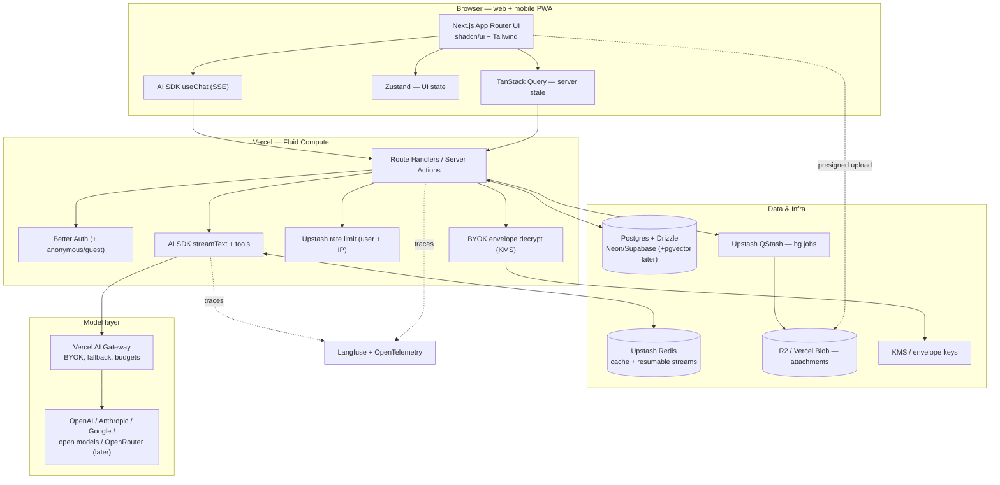

# PRD 04 — Technical Architecture

**Product:** A transparent, multi-model, privacy-first AI chat for web and mobile (mobile-web first).
**Primary persona (MVP):** Power users / developers. Secondary: privacy-conscious prosumers.
**Document type:** Engineering requirements / technical design (the buildable spec).
**Status:** Draft for build. Fast-moving facts are tagged **[confirm at build]**.
**Date:** 2026-05-27.
**Source research:** `docs/research/03-architecture.md` (primary), `docs/research/05-competitive-monetization.md` §6 (NFRs).

> **Priority tags:** **[P0/MVP]** = required to ship the MVP. **[P1]** = fast-follow, design for it now. **[P2]** = later / explicitly deferred.
> **Confidence:** facts the team must re-verify before locking implementation are marked **[confirm at build]** (e.g., exact Vercel max-duration, AI SDK major version).

---

## 1. Summary & purpose

This document converts the architecture research into a buildable engineering spec for the MVP and the immediate fast-follow. It defines the stack per layer, the streaming/resumability design, the data model, the provider-abstraction and BYOK security model, file uploads, cross-cutting concerns (rate limiting, jobs, observability), the security/privacy non-functional requirements, and the deployment/portability strategy.

The guiding principle is **MVP-fast-but-not-cornered**: pick pragmatic, Vercel-native defaults to ship quickly, but place every external dependency (provider, storage, auth, queue, cache, tracing) behind a thin adapter so a later move to Cloudflare, containers, OpenRouter, or LiteLLM is a *migration, not a rewrite*.

Three product constraints drive the architecture and are non-negotiable across all PRDs:
1. **Multi-provider model support from day one** via a thin provider-abstraction layer.
2. **Per-message transparency** — the data model captures the model used *and* token/cost usage *per message*.
3. **Privacy-first** — no-train-by-default, short configurable retention, one-click export/delete, and **guest/anonymous sessions** (chat before sign-up, then upgrade/link account).

---

## 2. Goals & non-goals (technical)

### Goals
- Ship a hosted, streaming, multi-model chat MVP on a TypeScript-first stack with the smallest viable service count.
- Make model choice, per-message model attribution, and per-message token/cost a **first-class part of the data model**, not an afterthought.
- Support **guest sessions** with seamless upgrade/linking to a real account, with no data loss on upgrade.
- Survive serverless function timeouts and network drops for long AI streams (resumable streams).
- Keep COGS controllable: rate-limit by user *and* IP (for guests), route work off the request path, and support BYOK.
- Keep the whole stack portable behind adapters; avoid one-way doors.
- Meet baseline security/privacy NFRs (encryption, key handling, no-train default, export/delete, AI-interaction disclosure).

### Non-goals (MVP)
- **[P2]** Native mobile apps — mobile is responsive web / PWA for MVP (see PRD 02).
- **[P2]** True live multi-device sync via WebSockets — defer; resumable streams + refetch first.
- **[P2]** RAG / document chat ingestion pipeline — schema reserves space (pgvector) but it is not built day-1.
- **[P2]** Voice (STT/TTS) — would pull WebSockets/Durable Objects forward; out of MVP scope.
- **[P2]** Self-hosted gateway (LiteLLM), SSO/SAML, SOC 2 audit — designed-for, not built for MVP.
- **[P2]** A separate vector DB (Pinecone) — only at large scale.

---

## 3. Architecture overview + reference diagram

The system is a Next.js App Router web app (responsive PWA for mobile) talking to Vercel serverless route handlers / server actions. The chat loop runs through the Vercel AI SDK (`streamText` / `useChat`) over SSE, with a Redis-backed resumable-stream layer for refresh/drop resilience. A thin provider layer (AI SDK providers behind the AI Gateway) fans out to model providers. Postgres (Drizzle) is the system of record; Upstash Redis backs cache + resumable streams; Upstash QStash runs background jobs; object storage holds attachments uploaded directly by the client via presigned URLs. Langfuse + OpenTelemetry provide tracing.



ASCII fallback:

```
Browser (Next.js + useChat/SSE, Zustand, TanStack Query)
   |  HTTP/SSE                                  \ presigned upload (direct)
   v                                             v
Vercel Route Handlers / Server Actions     Object storage (R2 / Vercel Blob)
  | auth   | rate-limit | byok-decrypt | stream | bg-job        ^
  v        v            v             v        v                |
BetterAuth Upstash     KMS          AISDK     QStash -----------+
                                     |
                                     v
                            Vercel AI Gateway --> OpenAI / Anthropic / Google / open / OpenRouter
  Postgres+Drizzle (chats/messages/usage)   Upstash Redis (cache + resumable streams)
                       \________ OTel traces ________/  -->  Langfuse
```

---

## 4. Stack decision table

| Layer | Choice (MVP) | Rationale | Main tradeoff | Alternative (when) |
|---|---|---|---|---|
| **Frontend** | Next.js App Router + shadcn/ui + Tailwind; responsive **PWA** for mobile | Largest ecosystem; the leading reference apps + the AI SDK's richest features are built here, so we inherit streaming/resumable/persistence patterns | App Router (RSC/caching/streaming) learning curve; mild Vercel gravity | React Router v7 / SvelteKit if team rejects RSC |
| **AI orchestration** | Vercel AI SDK (`ai` + `@ai-sdk/*`): `useChat` + `streamText`, tool calling | Collapses streaming protocol, tool-call streaming, message typing, provider switching, resumable streams into one maintained lib | v5/v6 API churn — pin versions, follow migration notes **[confirm at build: v5 vs v6]** | LangChain.js (heavier) only if agent complexity grows |
| **Transport** | **SSE** (AI SDK default) + Redis-backed resumable streams; abort via `AbortSignal` | Native, debuggable, robust; resumable streams survive refresh/timeout | No bidirectional (fine for chat); stop-from-resumed-connection edge case | WebSockets / Durable Objects only if voice/collab lands |
| **Provider layer** | AI SDK providers + **Vercel AI Gateway** (BYOK, fallback, budgets); thin adapter interface | One key → many models; zero-markup BYOK; usage/budget controls | Gateway lock-in (mitigated by adapter) | OpenRouter (breadth) / LiteLLM (self-host, compliance) later |
| **Database** | **Postgres + Drizzle** on Neon or Supabase | Serverless-friendly cold starts (~<500ms vs 1–3s Prisma); SQL control; working pgvector for future RAG | Drizzle is more SQL-forward, less "batteries-included" | Prisma if DX wins out and pgvector not needed |
| **Cache / Redis** | **Upstash Redis** (HTTP/REST) | No connection pooling, no cold-start penalty; same Redis backs resumable streams + rate limiting | HTTP-per-op latency vs persistent client | Self-managed Redis at scale |
| **Background jobs** | **Upstash QStash** (HTTP queue: retries, delay, DLQ) | Fits serverless without a worker fleet; idempotent retries | HTTP-queue semantics; not a full broker | SQS / a worker fleet at scale |
| **Auth** | **Better Auth** (anonymous plugin → account linking) | Owns users in *our* Postgres; best guest→account upgrade; passkeys/2FA/orgs built in; no per-MAU bill | Newer lib we operate **[spike: confirm prod maturity]** | **Supabase Auth** if we standardize on Supabase; Auth.js for fastest start (lacks native guest) |
| **Object storage** *(P1 — lands with attachments)* | **Cloudflare R2** (S3-compatible, presigned PUT); **Vercel Blob** acceptable | Zero egress fees at scale; direct client uploads keep files off function compute | R2 ecosystem younger; not needed until file attachments (P1) | S3 (max maturity, egress cost) behind same adapter |
| **Secrets / BYOK** | KMS-backed **envelope encryption** for user keys | Keys encrypted at rest, scoped per user, never logged | Adds a KMS dependency | Cloud-provider KMS equivalent on migration |
| **Observability** | **Langfuse** + **OpenTelemetry** export | OSS, self-hostable, tracing + prompt mgmt + evals; OTel avoids APM lock-in | Two systems to wire | Any OTel-compatible APM; avoid Helicone (maintenance mode) |
| **Deploy** | **Vercel** (Fluid Compute) for MVP | Fastest to ship; best AI SDK/Gateway/streaming integration; OTel export | Function max-duration limits; cost/egress at scale | Cloudflare (Workers/DO/Containers) or Fly/Railway at scale |

**One-line summary:** Next.js App Router + Vercel AI SDK over SSE (resumable) + Postgres/Drizzle + Upstash + Better Auth + R2 + Langfuse, on Vercel, with every external dependency behind a thin adapter.

---

## 5. Detailed requirements by area

### 5.1 Streaming & resumable streams

- **[P0/MVP]** Default transport is **SSE** via the AI SDK (`streamText` server-side, `useChat` client-side). Token-by-token streaming is the core UX requirement (TTFT is a tracked metric — see PRD 05 §7).
- **[P0/MVP]** Run the chat route on the **Node runtime** (richer library surface, safe streaming) on **Fluid Compute** to maximize stream duration. **[confirm at build]** the exact current max-duration (research cited ~800s on Pro/Enterprise as RECALLED — verify Hobby/Pro/Enterprise numbers against Vercel docs before locking timeouts).
- **[P0/MVP] Stop / abort:** `useChat` stop closes the client stream; an `AbortSignal` must propagate into `streamText` so the upstream provider request is cancelled (stop billing). On abort, persist the partial assistant message and mark the run aborted.
- **[P1] Resumable streams:** wrap the SSE stream with Vercel's `resumable-stream` library, backed by **Upstash Redis pub/sub**. On reconnect (page refresh / network drop on the *same* device) the client replays buffered tokens from the last cursor — **best-effort, subject to Redis retention; not a guarantee of lossless replay across arbitrary outages.** Requires: persist the in-progress assistant message *and* track the active stream id per chat (the `Stream` table). Design the persistence for this in MVP even if resumable replay ships as P1.
- **[P0/MVP] Orphaned-run edge case (must handle):** with resumable streams in serverless, a **stop issued from a *resumed* (different) connection may not reach the original generating process**, risking an orphaned run that bills until timeout. Mitigation:
  - The `Stream` row is the source of truth for run state (`active | done | aborted`).
  - A stop request writes `aborted` to the `Stream` row and publishes an abort signal on the Redis channel for that stream id.
  - The generating process polls/subscribes to that channel (or checks the row at each step boundary) and self-cancels its `AbortSignal` when it sees `aborted`.
  - A **reaper** (QStash scheduled job) marks `active` streams older than max-duration as `aborted` and reconciles their messages.
- **[P0/MVP] Long-stream-vs-timeout constraint:** functions cannot stream indefinitely. Three layered mitigations: (1) resumable streams (resume after a drop/timeout), (2) Fluid Compute for longer single runs (Cloudflare 5-min CPU Workers as the portability escape hatch), (3) push heavy/long non-token work (file processing, embeddings, title generation) to **QStash background jobs**, never the request path.
- **[P0/MVP] Error handling:** surface *stream* errors distinctly from *app* errors in the UI (the AI SDK scopes tool-execution errors to the tool and allows resubmission). Show partial output + a retry affordance on stream failure.

### 5.2 Provider abstraction & BYOK

- **[P0/MVP] Thin provider adapter:** all model calls go through one internal interface (`ModelProvider`) that wraps AI SDK providers behind the **Vercel AI Gateway**. App code references models by stable ids (e.g. `openai/gpt-...`, `anthropic/...`); swapping the gateway for OpenRouter or LiteLLM must not touch call sites.
- **[P0/MVP] Multi-provider from day one:** at minimum OpenAI, Anthropic, and Google, plus at least one cheap open model (DeepSeek/Flash class) as the default for free-tier / casual queries to control COGS (see PRD 05 §3).
- **[P0/MVP] Per-message model + usage capture:** every assistant message records the resolved `model_id` and token usage (prompt/completion/total) and a computed cost. This powers the transparency UX (model used + token cost per message) and unit-economics metrics. **This is a hard cross-PRD contract.**
- **[P0/MVP] BYOK key security:**
  - Encrypt user-supplied keys at rest with **envelope encryption** (data key per record, master key in KMS). Store only ciphertext in `api_key.encrypted_key`.
  - **Never log keys**; redact in error traces; never place keys in system prompts (OWASP LLM system-prompt-leakage risk).
  - Scope keys per user; decrypt only in-process at call time; never return plaintext to the client.
- **[P0/MVP] Platform-keys vs BYOK policy:** platform keys = we pay, we meter and rate-limit (default for free/Pro tiers); BYOK = user pays, we proxy with no token markup. The Gateway makes the BYOK proxy path simple. Metering/limits apply to platform-key usage; BYOK usage is still rate-limited for abuse but not metered for billing.
- **[P1] Provider drift handling:** model ids and capabilities (tools, vision, reasoning) move fast — keep a capability registry per model so the UI can gate features (e.g. vision-only models) and the adapter can fall back.

### 5.3 Data model — see §6 for the full draft schema

- **[P0/MVP]** Postgres + Drizzle is the system of record. Client state (Zustand for UI, TanStack Query for server state) is a cache; the DB is authoritative.
- **[P0/MVP]** Required tables for MVP: `user` (with `is_anonymous`), `chat` (with `visibility` + `model_id`), `message` (parts/attachments jsonb + per-message model + token usage), `stream`, `vote`, **`api_key` (BYOK — P0 per the launch-BYOK decision)**.
- **[P1]** `attachment` (file upload lands with vision/PDF understanding), `document` + `suggestion` (artifacts).
- **[P2]** `embedding` (RAG, pgvector) — reserve the design, do not build.

### 5.4 Storage & file uploads

> **Phase note:** file attachments are **P1** (they land with vision/PDF understanding — see PRD 02 §4.8). The lean text-core MVP ships no upload flow; this section is the **P1** design (build the adapter interface when attachments land, not before).

- **[P1] Presigned direct-to-storage upload:** client requests a presigned PUT URL from our API → browser uploads **directly** to object storage (keeps large files off function compute/timeout budget) → API writes the `attachment` row with object URL + metadata.
- **[P1] Validation:** server issues presigned URLs only for allowed content-types and a max size; verify object existence + size after upload before marking `ready`.
- **[P1] Async processing via queue:** thumbnailing/resize, PDF/text extraction (for future RAG), virus/abuse scanning run as **QStash background jobs**, never inline. `attachment.status` transitions `uploaded → processing → ready | failed`.
- **[P1] Storage adapter:** wrap R2/Blob/S3 behind one interface so R2 ↔ Blob ↔ S3 swaps are config, not code.

### 5.5 Auth & guest sessions

- **[P0/MVP] Guest/anonymous sessions are a hard requirement.** A first-time visitor can start chatting with **no sign-up**. The anonymous user gets a real `user` row with `is_anonymous = true`.
- **[P0/MVP] Upgrade / link:** on sign-up or OAuth login, the anonymous account is **linked/merged** into the real account with **no chat loss** (chats/messages re-parented to the upgraded user id). Better Auth's anonymous plugin provides anonymous→link natively.
- **[P0/MVP] Guest cost control:** guests are rate-limited by **IP** (and by anonymous user id) to cap model spend — see §5.6.
- **[P1]** Passkeys / 2FA, organizations / RBAC (Better Auth has these built in; enable as team features mature).
- **[P2]** SSO / SAML for teams (later — see §5.7).
- **Decision note / spike:** Better Auth is the lead recommendation (owns users in our Postgres, best guest→link). If we standardize the data platform on Supabase, use **Supabase Auth** (RLS synergy + anonymous sign-in). Auth.js gets us going fastest but lacks native guest sessions — rejected for MVP because guest is a hard requirement.

### 5.6 Rate limiting, jobs & observability

- **[P0/MVP] Rate limiting:** Upstash Redis + `@upstash/ratelimit` (sliding window). Limit **by authenticated user AND by IP for guests/anonymous** to cap model spend. Separate limit buckets for: message send, model calls (weighted by model cost class), and file uploads. Return `429` with retry-after; surface a clear UI state.
- **[P0/MVP] Caching:** Upstash Redis for session/state and hot reads (conversation list, model registry). Same Redis instance backs resumable streams.
- **[P1] Background jobs:** Upstash QStash for attachment processing, embeddings, **title generation**, webhooks, and the stream-reaper. Jobs must be **idempotent** (safe retries; QStash gives retries + DLQ).
- **[P0/MVP] Observability / tracing:** instrument the LLM calls with **Langfuse** (traces, token usage, latency, evals) and emit **OpenTelemetry** traces from route handlers + AI SDK so we can export to any APM and avoid lock-in. Track TTFT and full-response latency **per model** (PRD 05 §7 KPI). Avoid Helicone as a strategic dependency (maintenance mode).
- **[P0/MVP] Error handling:** distinguish stream errors, provider errors (rate-limit/quota/timeout — with fallback via Gateway), and app errors; log with key redaction; design idempotent retries for jobs.

### 5.7 Security & privacy NFRs (from research 05 §6)

- **[P0/MVP] Encryption:** TLS in transit everywhere; encryption at rest for DB and object storage; BYOK keys envelope-encrypted (§5.2).
- **[P0/MVP] No-train-by-default:** never send user chats to providers for training; choose provider API modes / DPAs that prohibit training on our traffic. Surface retention status in-product.
- **[P0/MVP] Retention controls + export/delete:** short, **configurable retention**; one-click **export** (user's chats/messages) and **delete** (hard-delete user + cascade). This is a privacy wedge and a GDPR requirement.
- **[P0/MVP] AI-interaction disclosure (EU AI Act transparency obligations land within the build horizon — ~Aug 2026 [confirm at build]):** a persistent UI affordance/flag disclosing the user is interacting with AI. Build the hook now (a disclosure flag in the chat UI + response metadata) — it is not deferrable given the timeline.
- **[P1] AI-content marking (EU AI Act content-labeling, deferral to ~Dec 2, 2026 **[confirm at build]**):** machine-readable marking of AI-generated content (metadata/label on exported/generated artifacts). Hook designed in `message`/`document` metadata; enforcement P1.
- **[P1] Prompt-injection mitigation (OWASP LLM Top 10, 2025):** clearly segregate/mark untrusted content (tool outputs, file contents, web results) from instructions; constrain model role/tools; validate inputs; run prompt-injection / system-prompt-leakage tests in CI. Becomes P0 the moment tools/RAG/web-browsing land.
- **[P1] PII handling:** minimize data sent to models; provide a no-telemetry mode; scan inputs/outputs as tooling matures.
- **[P2] SSO / SAML** (team tier), **SOC 2** path (audit logs, access controls designed for it now), **DPA** availability — designed-for in MVP (audit-log table, RBAC), delivered later.

### 5.8 Deployment & portability

- **[P0/MVP]** Deploy on **Vercel (Fluid Compute)** for speed-to-MVP and native AI SDK/Gateway/streaming integration.
- **[P0/MVP] Portability by adapter:** provider, storage, auth, cache/queue (Upstash over HTTP), and tracing (OTel) all behind thin interfaces. Drizzle keeps the DB portable. The escape hatches are explicit: Cloudflare (Workers 5-min CPU, Durable Objects for stateful/WebSocket, Containers for Node-heavy work; zero egress) or containers (Fly/Railway) for long-running/voice needs.
- **[P0/MVP] Client storage is non-authoritative:** client-side PWA storage (IndexedDB / Cache API) — **especially on iOS, which is evictable (~50 MB cap, 7-day eviction)** — must never hold authoritative chat state. Postgres remains the system of record; the client cache is best-effort and re-hydrated from the server (offline UX owned by PRD 03).
- **[P2] Realtime multi-device sync:** deferred. MVP relies on resumable streams (in-flight response survives refresh on the same device) + TanStack Query refetch on focus/navigation. True live multi-device push (SSE fan-out, Supabase Realtime, or Durable Objects) is added only when prioritized. Chat is mostly append-only, so last-write-wins on metadata + ordered inserts suffices; no CRDT for MVP.

---

## 6. Data model (draft schema)

Modeled on the Vercel Chat SDK schema (verified shape), extended for per-message model/usage transparency and BYOK. SQL-ish; `jsonb` where noted. UUID PKs unless stated.

```sql
-- USER --------------------------------------------------------------- [P0]
user (
  id            uuid pk,
  email         text null,              -- null for guests
  name          text null,
  is_anonymous  boolean not null default false,   -- guest sessions
  retention_days integer null,          -- per-user retention override
  created_at    timestamptz not null,
  updated_at    timestamptz not null
)

-- CHAT --------------------------------------------------------------- [P0]
chat (
  id          uuid pk,
  user_id     uuid not null references user(id) on delete cascade,
  title       text,
  visibility  text not null default 'private',   -- private | public | unlisted
  model_id    text not null,            -- default/selected model for the chat
  created_at  timestamptz not null,
  updated_at  timestamptz not null
)
-- index: (user_id, updated_at desc)

-- MESSAGE ------------------------------------------------------------ [P0]
-- "Message_v2" style: parts/attachments as jsonb; per-message model + usage
message (
  id            uuid pk,
  chat_id       uuid not null references chat(id) on delete cascade,
  role          text not null,          -- user | assistant | system | tool
  parts         jsonb not null,         -- text, tool calls, reasoning, etc.
  attachments   jsonb not null default '[]',
  model_id      text null,              -- resolved model for assistant msgs  *** transparency contract
  provider      text null,              -- openai | anthropic | google | ...
  prompt_tokens     integer null,
  completion_tokens integer null,
  total_tokens      integer null,
  cost_usd      numeric(14,8) null,     -- per-message cost; wide precision (cheap models cost <1e-6/msg)  *** transparency contract
  is_byok       boolean not null default false,
  ai_generated  boolean not null default false,  -- EU AI Act content-marking hook
  created_at    timestamptz not null
)
-- index: (chat_id, created_at)

-- ATTACHMENT --------------------------------------------------------- [P1] (lands with vision/PDF)
attachment (
  id            uuid pk,
  message_id    uuid null references message(id) on delete set null,
  user_id       uuid not null references user(id) on delete cascade,
  url           text not null,          -- R2/Blob/S3 object url
  content_type  text not null,
  size_bytes    bigint not null,
  status        text not null default 'uploaded',  -- uploaded|processing|ready|failed
  created_at    timestamptz not null
)

-- STREAM (resumable-stream tracking) --------------------------------- [P0 schema, P1 replay]
stream (
  id          uuid pk,                  -- the resumable stream id
  chat_id     uuid not null references chat(id) on delete cascade,
  user_id     uuid not null references user(id) on delete cascade,
  message_id  uuid null references message(id),  -- the assistant msg being generated
  status      text not null default 'active',    -- active | done | aborted
  created_at  timestamptz not null,
  updated_at  timestamptz not null
)
-- unique partial index: (chat_id) where status = 'active'  -- at most one active stream per chat,
--   so the abort channel + reaper reconcile deterministically
-- reaper job marks stale 'active' rows 'aborted'

-- VOTE ("Vote_v2": one vote per message) ----------------------------- [P0]
vote (
  chat_id     uuid not null references chat(id) on delete cascade,
  message_id  uuid not null references message(id) on delete cascade,
  is_upvoted  boolean not null,
  primary key (chat_id, message_id)
)

-- DOCUMENT (AI artifacts, versioned) --------------------------------- [P1]
document (
  id            uuid not null,
  created_at    timestamptz not null,
  user_id       uuid not null references user(id) on delete cascade,
  title         text,
  kind          text not null,          -- text | code | image | sheet
  content       text,
  ai_generated  boolean not null default true,  -- content-marking hook
  primary key (id, created_at)          -- composite pk = versioning
)

-- SUGGESTION (edit suggestions on a Document) ------------------------ [P1]
suggestion (
  id                   uuid pk,
  document_id          uuid not null,
  document_created_at  timestamptz not null,
  original_text        text,
  suggested_text       text,
  resolved             boolean not null default false,
  foreign key (document_id, document_created_at)
    references document(id, created_at) on delete cascade
)

-- API_KEY (BYOK, encrypted) ------------------------------------------ [P0] (BYOK ships at launch)
api_key (
  id            uuid pk,
  user_id       uuid not null references user(id) on delete cascade,
  provider      text not null,          -- openai | anthropic | google | ...
  encrypted_key bytea not null,         -- envelope-encrypted; NEVER logged
  key_hint      text null,              -- last-4 for UI only
  created_at    timestamptz not null
)

-- EMBEDDING (future RAG, pgvector) ----------------------------------- [P2]
-- CREATE EXTENSION vector;
embedding (
  id          uuid pk,
  document_id uuid not null,
  chunk       text not null,
  embedding   vector(1536),             -- dim per embedding model [confirm at build]
  created_at  timestamptz not null
)
-- ivfflat/hnsw index added when RAG is built

-- AUDIT_LOG (SOC 2 / security hook) ---------------------------------- [P1 design, P2 enforce]
audit_log (
  id          uuid pk,
  user_id     uuid null,
  action      text not null,            -- login, export, delete, key_add, ...
  metadata    jsonb,
  created_at  timestamptz not null
)
```

**Cross-PRD contract (must be respected):** `message` carries `model_id`, `provider`, token counts, and `cost_usd` per message; `user.is_anonymous` enables guest sessions; `ai_generated` on `message`/`document` is the EU AI Act content-marking hook.

---

## 7. Dependencies & cross-references

- **PRD 01 — Core Chat Experience** (chat UI): the transparency UX (model used + token cost per message) consumes `message.model_id` / `provider` / `cost_usd`; artifacts UX consumes `document`/`suggestion`; vote UX consumes `vote`; the streaming/stop UI sits on §5.1; conversation search reads the chat/message store.
- **PRD 02 — AI Capabilities** (model registry / AI contracts): defines the model catalog, capability flags (vision/tools/reasoning), routing policy, reasoning/usage semantics, and the cheap-default-model strategy that this PRD's provider adapter + capability registry (§5.2) implement. The §6 per-message model+token+cost schema is the data-layer counterpart of PRD 02's transparency contract.
- **PRD 03 — Mobile & Cross-Platform** (mobile/PWA UX): mobile is responsive web / PWA — no separate mobile framework. This PRD owns the service-worker / IndexedDB / sync internals, object storage, and the AI-data-disclosure consent plumbing that PRD 03's UX requirements depend on; streaming and a11y (live-region token announcements, touch targets) must hold on mobile web.
- **PRD 05 — Roadmap / Monetization / Metrics**: §5.7 NFRs implement PRD 05's product-level privacy/compliance policy; the rate-limiting + BYOK design (§5.2/§5.6) implements PRD 05's metered-free-tier + model-routing economics; observability (§5.6) emits the TTFT / cost-per-message signals PRD 05's KPIs consume.
- **Architecture research** (`docs/research/03-architecture.md`): the source this PRD's stack and patterns derive from.

---

## 8. Top architectural risks & mitigations

| # | Risk | Impact | Mitigation |
|---|---|---|---|
| 1 | **Long streams vs serverless timeouts** | Agentic/multi-step responses outlast function limits; dropped streams | Resumable streams (Redis) + Fluid Compute / 5-min CPU Workers + push heavy work to QStash; **explicitly handle the stop-from-resumed-connection orphaned run** (Stream-row source of truth + Redis abort channel + reaper job) |
| 2 | **Vendor lock-in / cost cliffs** | Heavy reliance on Vercel-native pieces (Gateway, Blob, Fluid Compute) and any per-MAU auth creates migration pain + cost cliffs | Thin adapters (provider/storage/auth/cache/queue); self-ownable defaults (Drizzle, Better Auth, R2, OTel); re-evaluate Cloudflare (zero egress, cheaper CPU) at scale |
| 3 | **AI SDK churn + provider drift** | `useChat`/transport changed materially in v5, v6 referenced; model ids/capabilities move fast | Pin versions; isolate the AI layer behind the provider adapter; maintain a per-model capability registry; read migration guides before upgrades **[confirm at build: target v5 vs v6]** |
| 4 | **BYOK key security** | Key leakage = direct financial + trust damage | Envelope encryption (KMS), per-user scoping, never log, never in system prompts, redact in traces; store only last-4 hint for UI |
| 5 | **Guest-traffic cost** | Free/anonymous users can run up model spend (inference-whale risk, PRD 05 §3) | Rate-limit by user AND IP; cheap default model for free/guest; weighted limits by model cost class; budgets in the Gateway |

---

## 9. Open questions / spikes

1. **Auth choice** — Better Auth vs Supabase Auth vs (fast) Auth.js. Gated on whether we standardize on Supabase as the data platform and Better Auth's production maturity. *Spike: prove guest→account linking with no data loss.*
2. **Postgres host** — Neon vs Supabase Postgres (branching vs bundled auth/storage/realtime + RLS).
3. **Vercel max-duration / Fluid Compute numbers** — **[confirm at build]** the ~800s figure and current Hobby/Pro/Enterprise limits before locking the streaming/timeout design.
4. **RAG in MVP?** — determines whether pgvector + an ingestion pipeline (LlamaIndex.TS / hand-rolled) is day-1 or deferred (currently P2).
5. **Voice scope** — STT/TTS would pull WebSockets/Durable Objects forward and change the transport decision; confirm out-of-scope for MVP.
6. **AI SDK major version** — target v5 vs v6 and its production maturity at build start; pin and isolate.
7. **BYOK policy at launch** — platform-keys-only vs user BYOK day-1 (affects billing/metering and key-encryption infra).
8. **Realtime multi-device sync priority** — confirm deferred (resumable streams + refetch) vs build SSE fan-out / Supabase Realtime / Durable Objects.

---

## 10. References

**Primary research:** `docs/research/03-architecture.md`; NFRs from `docs/research/05-competitive-monetization.md` §6.

Key source URLs (from research; re-verify fast-moving facts at build):
- Vercel AI Chatbot / Chat SDK — https://github.com/vercel/ai-chatbot , https://chat-sdk.dev/
- Chat SDK schema — https://www.mintlify.com/vercel/openchat/api/schema
- AI SDK 5 (SSE default, useChat transport, tools) — https://vercel.com/blog/ai-sdk-5 , https://ai-sdk.dev/docs/introduction
- Resumable streams — https://ai-sdk.dev/docs/ai-sdk-ui/chatbot-resume-streams , https://github.com/vercel/resumable-stream , https://github.com/vercel/ai/issues/6502 , https://github.com/vercel/ai/issues/8390
- Streaming transport (SSE vs WebSockets) — https://www.hivenet.com/post/llm-streaming-sse-websockets , https://websocket.org/guides/websockets-and-ai/
- Provider gateways / BYOK — https://vercel.com/ai-gateway , https://openrouter.ai/announcements/bring-your-own-api-keys , https://www.edenai.co/post/best-alternatives-to-litellm
- ORM & pgvector — https://orm.drizzle.team/docs/guides/vector-similarity-search , https://www.tigerdata.com/blog/pgvector-vs-pinecone
- Auth — https://better-auth.com/docs/plugins/anonymous , https://supastarter.dev/blog/better-auth-vs-nextauth-vs-clerk
- Storage — https://developers.cloudflare.com/r2/api/s3/presigned-urls/
- Rate limit / queues — https://github.com/upstash/ratelimit-js , https://upstash.com/docs/redis/tutorials/rate-limiting
- Observability — https://www.firecrawl.dev/blog/best-llm-observability-tools
- Security (OWASP LLM Top 10 2025) — https://www.oligo.security/academy/owasp-top-10-llm-updated-2025-examples-and-mitigation-strategies
- Deployment / runtime limits — https://vercel.com/docs/functions/runtimes , https://developers.cloudflare.com/workers/platform/limits/ , https://developers.cloudflare.com/changelog/post/2025-03-25-higher-cpu-limits/
- EU AI Act transparency — https://artificialintelligenceact.eu/article/50/
