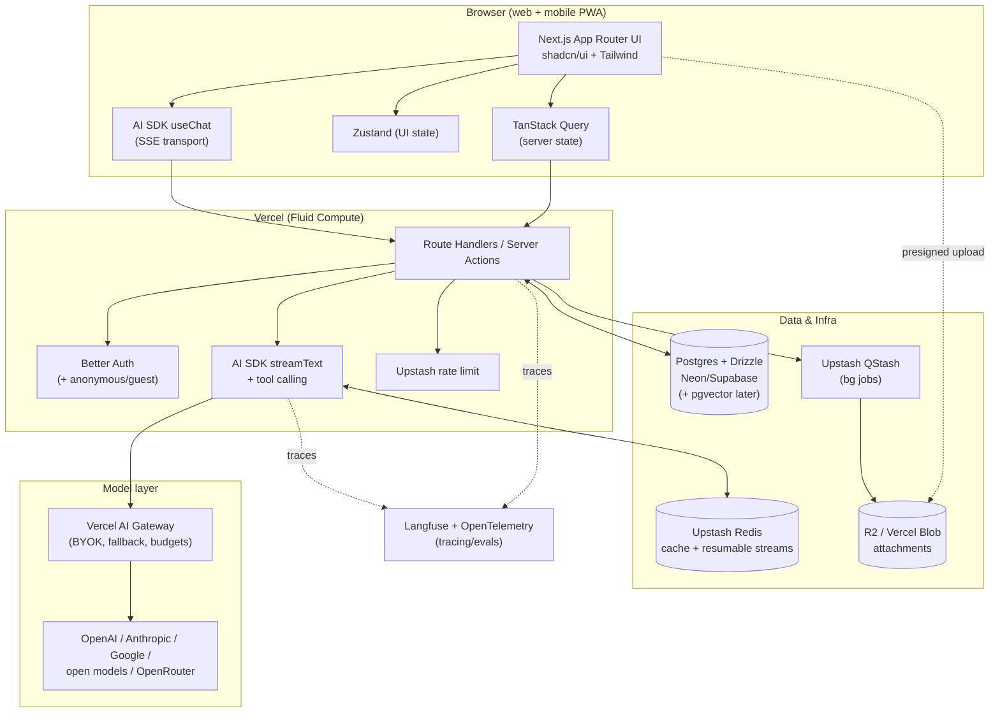

# 03 — Technical Architecture & Stack Research

> **Workstream:** Technical Architecture & Stack for a web-based AI chat interface (web + mobile browsers), comparable to the web apps of ChatGPT / Claude / Gemini / Perplexity.
> **Goal:** Pick a stack that lets a small team ship an MVP fast without painting itself into a corner.
> **Status:** Research phase — feeds the PRDs. Opinionated, with rationale.
> **Date:** 2026-05-27.

## How to read this doc

- **[VERIFIED]** = confirmed against a cited source fetched during this research.
- **[RECALLED]** = drawn from prior knowledge; not re-verified against a live source in this pass. Treat as a hypothesis to confirm during spike work.
- Source URLs are cited inline. A consolidated list is at the bottom.
- The fast-moving parts here are the Vercel AI SDK (v5/v6 era), serverless runtime limits, and auth library positioning — re-check these before locking the PRD.

---

## 1. Reference open-source apps studied

These are the projects worth learning from. Their stack choices are the best available signal for "what works" in this category.

| Project | Frontend / Runtime | LLM layer | Data store | Auth | Positioning & tradeoff |
|---|---|---|---|---|---|
| **Vercel `ai-chatbot` / Chat SDK** | Next.js App Router + RSC + Server Actions, shadcn/ui, Tailwind | Vercel **AI SDK** + AI Gateway (OpenAI, Anthropic, Google, xAI, Mistral, DeepSeek, Moonshot) | Neon Serverless **Postgres** + **Drizzle** | **Auth.js** | The canonical "modern Vercel" reference. TS-first, RSC-heavy, resumable streams, Vercel Blob storage. Best blueprint for *our* target. Tradeoff: leans on Vercel-native features (Gateway, Blob, Fluid Compute). [VERIFIED: github.com/vercel/ai-chatbot, vercel.com/templates] |
| **LibreChat** | React SPA + Node/Express API | Custom per-provider endpoints; LangChain; native MCP; agents | **MongoDB** (chat history) + **Meilisearch** (search) + **PostgreSQL/pgvector** via a Python FastAPI RAG service | OAuth / LDAP / OIDC | "Drop-in ChatGPT replacement" for orgs. Widest provider + enterprise auth support. Tradeoff: heavier multi-service architecture (Mongo + Meili + Postgres + Python RAG). [VERIFIED: elest.io, portkey.ai comparisons] |
| **Lobe Chat** | Next.js | Many providers, local models, multimodal (vision), TTS/STT | Postgres (+ built-in RAG) | Multiple | Feature-rich consumer-style UI, plugins, knowledge bases. Tradeoff: built-in RAG is simplest but least tunable. [VERIFIED: sider.ai, elest.io] |
| **Open WebUI** | Svelte frontend + **Python** backend | Pipeline architecture; Ollama-first; strong RAG | SQLite/Postgres | Built-in | Power-user / local-model + RAG platform. Polished for self-hosted/Ollama. Tradeoff: Python backend, less "web SaaS"-shaped than the others. [VERIFIED: houseoffoss.com, apipie.ai] |
| **Chatbot UI** | Next.js + Supabase | OpenAI-compatible | **Supabase** (Postgres + Auth + Storage) | Supabase Auth | Minimal, Supabase-centric starter. Good "all-in-one BaaS" reference. Tradeoff: smaller scope, less actively the bleading edge than Vercel's template. [RECALLED — confirm current maintenance status] |

**Takeaway:** The two architectural archetypes are (a) **Next.js + Vercel AI SDK + Postgres/Drizzle** (Vercel template, Lobe), optimized for a TS web SaaS, and (b) **separate API backend + multi-service** (LibreChat, Open WebUI), optimized for self-hosting and enterprise breadth. For a small team shipping a hosted MVP fast, archetype (a) is the better fit and the rest of this doc recommends it.

---

## 2. Frontend framework

For a streaming chat app with SSR/edge, the realistic contenders are Next.js (App Router), React Router v7 (formerly Remix), SvelteKit, and Nuxt.

| Framework | Strengths for streaming chat | Weaknesses | Verdict |
|---|---|---|---|
| **Next.js (App Router)** | Most popular React framework; first-class streaming + RSC + Server Actions; Partial Prerendering (static shell + streamed dynamic) graduating to GA in Next 16; deepest AI-SDK and Vercel integration; biggest ecosystem & hiring pool | App Router mental model is steep (RSC boundaries, caching, streaming); ships more JS than Svelte/Astro; some features are best on Vercel | **Recommended.** Ecosystem + AI SDK + reference templates outweigh the learning curve. [VERIFIED: dev.to/pockit, strapi.io] |
| **React Router v7 (Remix)** | Server-first, every page streams HTML+data in one request; fast TTFB; smaller JS payloads; less "magic" than App Router; Shopify-backed = stable/pragmatic | Smaller AI-SDK template/community gravity than Next; "less cutting-edge"; without static export every miss hits the DB unless you add caching | Strong alternative if the team dislikes RSC. [VERIFIED: same] |
| **SvelteKit** | Smallest JS footprint, fastest hydration, simplest model; great for small teams avoiding RSC overhead; AI SDK has a Svelte adapter | Smaller ecosystem; some features need custom work; smaller hiring pool | Good if team already knows Svelte. [VERIFIED: same] |
| **Nuxt (Vue)** | Mature SSR, good DX, streaming support | Vue ecosystem for AI chat is thinner; fewer turnkey AI chat references | Only if team is Vue-native. [RECALLED] |

**Recommendation: Next.js App Router.** The deciding factor is that the strongest reference implementation (Vercel `ai-chatbot`/Chat SDK) and the AI SDK's richest features are built around it, so we inherit battle-tested patterns for streaming, resumable streams, and persistence instead of reinventing them. The main tradeoff we accept is the App Router learning curve and a mild gravitational pull toward Vercel-native infra. Mobile is handled by responsive web (PWA), not a separate framework, for the MVP.

---

## 3. AI orchestration layer

| Option | What it gives you | Tradeoff |
|---|---|---|
| **Vercel AI SDK** (`ai` + `@ai-sdk/*`) | Unified provider API (`generateText`, `streamText`, structured objects, tool calling); `useChat` React hook with transport-based architecture; **SSE** as the standard stream protocol; streaming tool inputs; type-safe `tool-NAME` parts; `UIMessage` (app state of record) vs `ModelMessage` (model-bound); multi-step agent loops; resumable-stream tooling | The de-facto standard for TS chat apps. v5 changed `useChat` significantly (no internal input state, transport-based) — pin versions and read migration notes. [VERIFIED: vercel.com/blog/ai-sdk-5, ai-sdk.dev] |
| **LangChain.js** | Chains, agents, tool ecosystem, retrievers, broad integrations | Heavier abstraction; more surface area than an MVP chat needs; LibreChat uses it for RAG specifically, not the whole app. [RECALLED] |
| **LlamaIndex (TS)** | RAG-centric data framework: ingestion, indexing, retrieval | Best as a RAG *complement*, not the core chat transport. [RECALLED] |
| **Raw `fetch` + provider SDKs** | Zero abstraction, full control | You re-build streaming parsing, tool-call plumbing, provider switching, resumable streams yourself. Not worth it for an MVP. [RECALLED] |

**Recommendation: Vercel AI SDK as the core.** Use `useChat` + `streamText` for the chat loop and tool calling, and add a RAG library (LlamaIndex.TS or hand-rolled pgvector retrieval) later if/when document chat is in scope. Rationale: it collapses the hardest parts of a chat app (streaming protocol, tool-call streaming, provider switching, message typing, resumable streams) into a maintained library, and it is the exact layer the reference template uses.

---

## 4. Streaming transport

Token-by-token streaming is the defining UX requirement.

| Transport | Fit for token streaming | Notes |
|---|---|---|
| **Server-Sent Events (SSE)** | **Best default.** Unidirectional server→client over long-lived HTTP; natively supported in all browsers; easy to debug in devtools; maps cleanly to token streams. The AI SDK uses SSE as its standard protocol in v5+. | One-way only; auto-reconnect built into `EventSource`. Use this for MVP. [VERIFIED: hivenet.com, vercel.com/blog/ai-sdk-5] |
| **HTTP chunked streaming** | Works; what `streamText` emits under the hood, framed as SSE | Same constraints as SSE. [VERIFIED] |
| **WebSockets** | Needed only for *bidirectional* mid-stream needs: live interrupts, collaborative editing, voice, typing/cursor sync | More infra (stateful connections, scaling, sticky sessions); overkill for plain chat. Adopt later only if voice/collab lands. [VERIFIED: websocket.org, render.com] |

**Stop / abort:** The AI SDK + `useChat` expose stop/abort; the client closes the stream and an `AbortSignal` propagates to `streamText`. **Caveat:** with resumable streams in serverless, a stop issued from a *resumed* (different) connection may not reach the original generating process, risking an orphaned run until timeout — design the persistence layer to record stream state and reconcile. [VERIFIED: github.com/vercel/ai issues #6502, #8390]

**Resumable streams:** For refresh/network-drop resilience, use Vercel's `resumable-stream` library: it wraps the SSE stream and uses a **Redis pub/sub** to let clients reconnect and replay only missed tokens. Requires persisting messages *and* tracking the active stream id per chat. The Chat SDK ships a `Stream` table for exactly this. [VERIFIED: github.com/vercel/resumable-stream, ai-sdk.dev/docs/ai-sdk-ui/chatbot-resume-streams]

**Edge vs Node runtime:**
- **Node runtime** supports streaming by default, has a richer library surface, and is the safer default for AI workloads. [VERIFIED: vercel.com/docs/functions/runtimes]
- **Edge runtime** has lower cold starts and global execution but a constrained API surface.
- Critically, **functions cannot stream indefinitely** — there is always a max duration. On Vercel, **Fluid Compute** extends durations (up to ~800s on Pro/Enterprise per recalled figures) and improves concurrency, which is the mechanism that makes long AI streams viable on serverless. [VERIFIED: vercel.com/docs runtimes confirms max-duration exists + Node streaming; the 800s figure is RECALLED — confirm current number]

---

## 5. Provider abstraction & BYOK

Supporting multiple model providers (OpenAI, Anthropic, Google, open models) is table stakes for a ChatGPT/Claude-class product.

| Layer | Role | Tradeoff |
|---|---|---|
| **Vercel AI SDK providers** (`@ai-sdk/openai`, `@ai-sdk/anthropic`, `@ai-sdk/google`, etc.) | In-code provider abstraction; switch models with `openai/gpt-4o`-style ids | Native to our stack; no extra hop. Use as the baseline. [VERIFIED] |
| **Vercel AI Gateway** | One key → hundreds of models; usage monitoring, budgets, load balancing, fallback; **BYOK at provider list prices with zero markup**; ~$5/mo starter credit then pay-as-you-go | Most natural with the AI SDK / Vercel; some platform lock-in. Strong MVP default. [VERIFIED: getmaxim.ai, vercel.com] |
| **OpenRouter** | Widest hosted-model catalog, least setup; single API for many models; supports BYOK | It's a proxy, not an intelligent router (availability/manual routing; no cost/quality optimization, no A/B). Good for breadth/fast start. [VERIFIED: pinggy.io, helicone.ai] |
| **LiteLLM** | Self-hosted, OpenAI-compatible gateway; full control over networking/data/policy/budgets across many apps | You run and operate it. Best when compliance/internal-networking matters more than convenience — a *later* scale-up option, not MVP. [VERIFIED: inworld.ai, edenai.co] |

**BYOK (bring your own key) considerations [partly RECALLED]:**
- Encrypt user-supplied keys at rest (e.g., envelope encryption / KMS); never log them; scope them to the user/session.
- Decide policy: platform keys (you pay, you meter/limit) vs BYOK (user pays, you proxy). A Gateway/router makes the BYOK path much simpler.
- Beware system-prompt/credential leakage (OWASP LLM: keys in system prompts can leak). [VERIFIED: oligo.security OWASP LLM 2025]

**Recommendation:** AI SDK providers + **Vercel AI Gateway** for the MVP (unified billing, budgets, fallback, BYOK with no markup). Keep the provider layer thin so we can drop in OpenRouter (breadth) or LiteLLM (self-host/compliance) later without touching app code.

---

## 6. State & data layer

### 6.1 Client state
- **Server state / data fetching:** **TanStack Query (React Query)** for conversations list, history, etc. The live chat stream itself is owned by AI SDK `useChat`. [RECALLED]
- **Local UI state:** **Zustand** (simple, minimal) for things like sidebar, model selector, draft input. Jotai is a fine atom-based alternative. Keep client state small; the server/DB is the source of truth. [RECALLED]

### 6.2 Persistence: Postgres + ORM

| ORM | Pros | Cons |
|---|---|---|
| **Drizzle** | ~90% smaller bundle than Prisma; cold starts <500ms vs 1–3s for Prisma — matters for serverless; SQL-level control; **pgvector** vector similarity search supported (must `CREATE EXTENSION` manually) | More SQL-forward; less "batteries included" | 
| **Prisma** | Best-in-class DX, automated migrations, mature | Larger bundle/cold start; as of late 2025, **incomplete pgvector & partitioning support** without workarounds |

[VERIFIED: orm.drizzle.team, designrevision.com, dev.to pgvector]

**Recommendation: Postgres + Drizzle.** It's what the Vercel reference uses, it's serverless-friendly (cold starts), and it has working pgvector support for future RAG. Host: **Neon** or **Supabase Postgres** (serverless, branching).

### 6.3 Vector DB for RAG (future-facing)

| Option | When |
|---|---|
| **pgvector (+ pgvectorscale)** | Default. Under ~1M vectors, latency is dominated by the embedding API call anyway; pgvectorscale reaches ~471 QPS at 99% recall, competitive with Pinecone. Keeps everything in one Postgres. [VERIFIED: tigerdata.com, dev.to] |
| **Pinecone serverless** | When you exceed ~5–10M vectors and want automatic scaling without tuning. [VERIFIED: encore.dev, firecrawl.dev] |

**Recommendation:** Don't add a separate vector DB for the MVP. If/when RAG ships, use **pgvector in the same Postgres**; graduate to Pinecone only at large scale.

### 6.4 Draft data model

Modeled on the Vercel Chat SDK schema (verified shape), normalized for our needs:

```
User
  id (uuid, pk)
  email (nullable for guests)
  is_anonymous (bool)            -- guest sessions
  created_at

Chat
  id (uuid, pk)
  user_id (fk -> User)
  title
  visibility (private | public | unlisted)
  model_id                       -- selected model/provider
  created_at, updated_at

Message            -- "Message_v2" style
  id (uuid, pk)
  chat_id (fk -> Chat)
  role (user | assistant | system | tool)
  parts (jsonb)                  -- text, tool calls, reasoning, etc.
  attachments (jsonb)            -- links to Attachment rows / blob urls
  created_at

Attachment
  id (uuid, pk)
  message_id (fk -> Message)
  user_id (fk -> User)
  url                            -- S3/R2/Blob object url
  content_type, size_bytes
  status (uploaded | processing | ready | failed)
  created_at

Stream             -- resumable-stream tracking
  id (uuid, pk)
  chat_id (fk -> Chat)
  status (active | done | aborted)
  created_at

Vote               -- "Vote_v2": one vote per message
  chat_id (fk), message_id (fk)  -- composite pk
  is_upvoted (bool)

Document           -- AI-generated artifacts, versioned
  id (uuid), created_at          -- composite pk for versioning
  user_id (fk), title, kind (text | code | image | sheet), content

Suggestion         -- edit suggestions on a Document
  id (uuid, pk)
  document_id, document_created_at (fk -> Document composite)
  original_text, suggested_text, resolved (bool)

ApiKey             -- BYOK (optional)
  id (uuid, pk)
  user_id (fk -> User)
  provider (openai | anthropic | google | ...)
  encrypted_key                  -- KMS/envelope-encrypted, never logged
  created_at

-- RAG (future): Embedding(id, document_id, chunk, embedding vector(N)) using pgvector
```

[Schema shape VERIFIED against the Chat SDK schema docs: Message_v2 (parts/attachments jsonb), Vote_v2 (composite pk), Document (composite pk versioning), Suggestion, Stream. ApiKey/RAG tables are our additions — RECALLED design.]

---

## 7. Auth

| Option | Pros | Cons | Guest sessions |
|---|---|---|---|
| **Better Auth** | TS-native, owns users in *your* Postgres; built-in passkeys/2FA/organizations/RBAC; no vendor lock-in; free (~$20–50/mo for email) | Newer; you operate it | **Best-in-class:** Anonymous plugin gives an authenticated experience with no PII, and can **link** the anonymous account to a real one on later sign-up. [VERIFIED: better-auth.com/docs/plugins/anonymous] |
| **Clerk** | Fastest path to production sign-in UI + user management | Per-MAU pricing scales painfully (~$0.02/MAU above 50k → ~$1k+/mo at 100k) | Supported, but cost dominates at scale |
| **Supabase Auth** | Tight Postgres + **RLS** integration (replaces a chunk of authz code); part of Supabase | Best only if you're on Supabase | Anonymous sign-in supported |
| **Auth.js / NextAuth v5** | OAuth-focused, ubiquitous adapters, what the Vercel template uses | No built-in 2FA/passkeys/orgs/RBAC — you build them; **no native guest sessions** | Not built-in [VERIFIED: github discussions] |

[VERIFIED: makerkit.dev, supastarter.dev, medium/better-dev comparisons]

**Guest/anonymous sessions are a hard requirement** for a ChatGPT-style product (users should chat before signing up). That single requirement is the strongest differentiator here.

**Recommendation:**
- If we want to **own user data in our own Postgres** and have the best guest→account upgrade flow: **Better Auth** (anonymous plugin + later account linking). This is my lead recommendation for not painting ourselves into a corner.
- If we choose **Supabase** as the data platform: use **Supabase Auth** (RLS synergy + anonymous sign-in).
- Auth.js is acceptable to inherit the Vercel template quickly, but its lack of native guest sessions and 2FA/passkeys/orgs means we'd build those ourselves — a likely future migration. Note the common 2026 pattern: ship on a managed auth, migrate to Better Auth/Supabase around ~50k MAU.

---

## 8. File / attachment storage

| Option | Pros | Cons |
|---|---|---|
| **Cloudflare R2** | **Zero egress fees** (huge for image/doc downloads at scale); S3-compatible API; client-side presigned PUT URLs (no server roundtrip, no exposed creds) | Younger ecosystem than S3 (some features still maturing) |
| **AWS S3** | Max ecosystem maturity & features; presigned URLs | $0.09/GB egress can become a real cost center (10TB/mo ≈ $900) |
| **Vercel Blob** | Tightest Vercel integration; simplest in the Vercel template | Smaller feature set; pricing/egress to evaluate; lock-in |

[VERIFIED: developers.cloudflare.com/r2 presigned URLs, payloadcms.com, starterpick.com]

**Upload flow (recommended):** client requests a **presigned upload URL** from our API → browser uploads **directly** to object storage (keeps large files off our function compute/timeout budget) → API stores the object URL + metadata in the `Attachment` row → async processing (image resize/thumbnail, PDF/text extraction for future RAG) via a background job. [RECALLED pattern, presigned URL mechanics VERIFIED]

**Recommendation:** **Cloudflare R2** for cost (zero egress) with S3-compatible presigned uploads. **Vercel Blob** is the lower-friction MVP choice if we stay fully Vercel-native and traffic is modest; design the storage adapter behind an interface so swapping R2↔Blob↔S3 is cheap.

---

## 9. Cross-cutting concerns

- **Rate limiting:** **Upstash Redis** + `@upstash/ratelimit` (sliding-window). HTTP/REST client → no connection pooling, no cold-start penalty, ideal for serverless/edge. Rate-limit by user and by IP (esp. for guest/anonymous traffic) to control model spend. [VERIFIED: upstash docs, github.com/upstash/ratelimit-js]
- **Caching:** Upstash Redis for session/state and hot reads (sub-ms vs hundreds of ms). The same Redis backs resumable streams. [VERIFIED: digitalapplied.com]
- **Background jobs / queues:** **Upstash QStash** (HTTP message queue with retries, delays, DLQ) for attachment processing, embeddings, title generation, webhooks. Fits serverless without a worker fleet. [VERIFIED: upstash]
- **Observability / tracing:** **Langfuse** as the primary LLM-observability platform (open-source, self-hostable, tracing + prompt management + evals; free Hobby tier ~50k events/mo). Emit **OpenTelemetry** traces so we avoid vendor lock-in (Vercel Functions can export OTel to any APM). Helicone is the fastest drop-in gateway-style logger but is reportedly in **maintenance mode** — avoid as a strategic dependency. [VERIFIED: firecrawl.dev, confident-ai.com, softcery.com; OTel export VERIFIED in vercel runtimes doc]
- **Security:**
  - **Prompt injection (OWASP LLM Top 10, 2025):** segregate/clearly mark untrusted content, constrain model role/tools, validate inputs, apply guardrails; run prompt-injection/system-prompt-leakage tests in CI. [VERIFIED: oligo.security]
  - **Key handling:** least privilege; never put secrets in system prompts (leakage risk); encrypt BYOK keys at rest; never log keys. [VERIFIED]
  - **PII:** scan inputs/outputs, minimize data sent to models, build compliance controls early. [VERIFIED]
- **Error handling:** AI SDK scopes tool-execution errors to the tool and allows resubmission; surface stream errors to the UI distinctly from app errors; design idempotent retries for queued jobs. [VERIFIED: ai-sdk.dev]

---

## 10. Deployment & infra

| Target | Pros | Cons / watch-outs |
|---|---|---|
| **Vercel** | Best Next.js DX; AI SDK/Gateway/Blob integration; **Fluid Compute** extends function duration & concurrency (needed for long streams); OTel tracing; one-click deploy | Per-seat Pro pricing; **functions still can't stream indefinitely** (max duration); some lock-in |
| **Cloudflare (Workers + Durable Objects + Containers)** | Cheaper compute (~44% lower CPU cost cited); **no egress fees**; Workers now allow up to **5 min CPU time**/request; Durable Objects = stateful + native WebSockets (great for future realtime); Containers (2025, scale-to-zero, CPU billed on active use) for Node-heavy work | Smooth streaming can hit Worker **CPU limits** (reported); Node compat historically weaker (improving via Containers); more assembly required |
| **Containers / self-host** (Fly, Railway, Northflank, own k8s) | Full control; long-running processes; no serverless timeout; good for WebSockets/voice later | You own scaling, ops, cold-start mitigation; slower to MVP |

[VERIFIED: developers.cloudflare.com/workers limits & changelog (5-min CPU), pricing; morphllm.com comparison; vercel.com/docs functions runtimes; github.com/vercel/ai #6492]

**Key constraint:** Long AI streams vs serverless timeouts is the central infra tension. Mitigations: (1) **resumable streams** (Redis-backed) so a dropped/timed-out stream can resume; (2) **Fluid Compute** (Vercel) or **5-min CPU Workers** (Cloudflare) for longer single runs; (3) keep heavy/long work (file processing, embeddings) in **queued background jobs**, not the request path.

**Recommendation for MVP:** Deploy on **Vercel** to maximize speed-to-MVP and inherit the AI SDK/Gateway/streaming integration. Keep infra portable (Drizzle, S3-compatible storage adapter, Upstash over HTTP, OTel) so a later move to Cloudflare or containers — driven by cost or realtime/voice needs — is a migration, not a rewrite. Re-evaluate at scale where Cloudflare's zero-egress + cheaper CPU becomes material.

---

## 11. Real-time multi-device sync

For "open the same chat on phone and laptop, see it update live":
- **MVP:** On focus/navigation, refetch via TanStack Query; resumable streams handle an in-flight response surviving a refresh on the *same* device. This covers most needs cheaply. [RECALLED]
- **True live multi-device:** push updates via SSE (server pushes new messages to other open clients) or a managed realtime layer (**Supabase Realtime**, or **Cloudflare Durable Objects** for stateful fan-out / future WebSocket needs). [VERIFIED: Durable Objects WebSocket support]
- **Conflict model:** chat append is mostly append-only, so last-write-wins on title/metadata plus ordered message inserts is sufficient; no CRDT needed for an MVP. [RECALLED]

**Recommendation:** Defer true realtime sync past MVP. Rely on resumable streams + refetch first; add SSE-based fan-out or a realtime service only when multi-device live sync is a prioritized feature.

---

## 12. Proposed reference architecture



ASCII fallback:

```
Browser (Next.js + useChat/SSE, Zustand, TanStack Query)
        |  HTTP/SSE                         \ presigned upload
        v                                    v
Vercel Route Handlers/Server Actions   Object storage (R2 / Vercel Blob)
  |        |        |        |               ^
  | auth   | rate   | stream | bg-job        |
  v        v        v        v               |
BetterAuth Upstash  AISDK    QStash ---------+
                     |
                     v
              Vercel AI Gateway --> OpenAI/Anthropic/Google/open/OpenRouter
  Postgres+Drizzle (chats/messages/...)   Upstash Redis (cache + resumable streams)
                     \________ OTel traces ________/  -->  Langfuse
```

---

## 13. Recommended stack for MVP (with rationale & tradeoffs)

| Layer | Recommendation | Rationale | Main tradeoff |
|---|---|---|---|
| **Frontend** | Next.js (App Router) + shadcn/ui + Tailwind; responsive PWA for mobile | Largest ecosystem; the leading reference apps + AI SDK features are built here; inherits streaming/resumable/persistence patterns | App Router learning curve; mild Vercel gravity |
| **AI orchestration** | Vercel AI SDK (`ai` + `@ai-sdk/*`), `useChat` + `streamText` | Collapses streaming, tool-call streaming, message typing, provider switching, resumable streams into one maintained lib | v5/v6 API churn — pin versions, follow migration notes |
| **Transport** | SSE (AI SDK default) + Redis-backed resumable streams; abort via AbortSignal | Native, debuggable, robust; resumable streams survive refresh/timeout | Stop-from-resumed-connection edge case; no bidirectional (fine for chat) |
| **Provider layer** | AI SDK providers + Vercel AI Gateway (BYOK, fallback, budgets); thin abstraction | One key, many models, zero-markup BYOK; swap to OpenRouter/LiteLLM later | Gateway lock-in; keep adapter thin |
| **Backend / DB** | Postgres (Neon or Supabase) + Drizzle; Upstash Redis; Upstash QStash for jobs; pgvector for RAG (later) | Serverless-friendly cold starts; SQL control; working pgvector; HTTP Redis/queue fit serverless | Drizzle is more SQL-forward than Prisma |
| **Auth** | Better Auth (anonymous plugin → account linking). Supabase Auth if we standardize on Supabase. | Owns users in our Postgres; **best guest→account upgrade**; passkeys/2FA/orgs built in; no per-MAU bill | Newer lib we operate; (Auth.js gets us going faster but lacks guest sessions) |
| **Storage** | Cloudflare R2 (presigned uploads); Vercel Blob acceptable for fast MVP | Zero egress fees at scale; S3-compatible; direct client uploads keep files off compute | R2 ecosystem younger; hide behind a storage adapter |
| **Observability** | Langfuse + OpenTelemetry | OSS, self-hostable, tracing + prompt mgmt + evals; OTel avoids lock-in | Helicone (easy) is in maintenance mode — avoid strategically |
| **Deploy** | Vercel (Fluid Compute) for MVP; keep portable to Cloudflare/containers | Fastest to ship + best AI SDK integration; long streams handled by Fluid Compute + resumable streams + queued bg work | Function max-duration limits; cost & egress at scale |

**One-line summary:** Next.js App Router + Vercel AI SDK over SSE (resumable) + Postgres/Drizzle + Upstash + Better Auth + R2 + Langfuse, deployed on Vercel, with every external dependency behind a thin adapter so the team can move to Cloudflare/containers/LiteLLM at scale without a rewrite.

---

## 14. Top architectural risks

1. **Long streams vs serverless timeouts.** AI responses (esp. agentic/tool-using multi-step) can outlast function limits. Mitigate with resumable streams (Redis), Fluid Compute / 5-min CPU Workers, and pushing heavy work to QStash jobs. The stop-from-resumed-connection orphaned-run case needs explicit handling. [VERIFIED]
2. **Vendor lock-in / cost cliffs.** Heavy reliance on Vercel-native pieces (Gateway, Blob, Fluid Compute) and per-MAU auth (if Clerk) can create migration pain and cost cliffs at scale. Mitigate with thin adapters (storage, provider, auth) and choosing self-ownable defaults (Drizzle, Better Auth, R2, OTel) from day one.
3. **AI SDK API churn + provider drift.** `useChat`/transport changed materially in v5, and v6 is already referenced; provider model ids and capabilities (tools, vision, reasoning) move fast. Mitigate by pinning versions, isolating the AI layer, and tracking migration guides before upgrades. [VERIFIED]

Secondary risks: BYOK key security (encryption/leakage), prompt-injection/PII exposure once tools/RAG land, and rate-limiting guest traffic to control model spend.

---

## 15. Open questions (for PRD / spikes)

- **Auth decision:** Better Auth vs Supabase Auth vs (fast) Auth.js — gated on whether we adopt Supabase as the data platform and how important guest→account linking is at launch.
- **Hosting Postgres:** Neon vs Supabase Postgres (branching, RLS, bundled auth/storage/realtime vs best-of-breed).
- **Exact current Vercel max-duration / Fluid Compute numbers** — confirm the 800s figure and current Hobby/Pro/Enterprise limits before committing the streaming design. [the limit-exists is VERIFIED; the number is RECALLED]
- **RAG in MVP scope?** Determines whether pgvector + an ingestion pipeline (LlamaIndex.TS) is day-1 or deferred.
- **Multimodal scope:** image input/vision, file/PDF chat, voice (STT/TTS) — voice especially would pull WebSockets/Durable Objects forward.
- **BYOK policy:** platform-keys-only vs user BYOK at launch (affects billing, metering, key-encryption infra).
- **Realtime multi-device sync priority:** defer vs build with SSE fan-out / Supabase Realtime / Durable Objects.
- **Chatbot UI maintenance status** — confirm it's still a current reference or treat as legacy.
- **AI SDK major version to target** (v5 vs v6) and its production maturity at our build start.

---

## Sources

- Vercel AI Chatbot template / Chat SDK — https://github.com/vercel/ai-chatbot , https://vercel.com/templates/next.js/nextjs-ai-chatbot , https://chat-sdk.dev/ , https://vercel.com/kb/guide/the-complete-guide-to-chat-sdk
- Chat SDK database schema — https://www.mintlify.com/vercel/openchat/api/schema
- AI SDK 5 (SSE default, useChat transport, tool streaming, UIMessage/ModelMessage) — https://vercel.com/blog/ai-sdk-5 , https://ai-sdk.dev/docs/introduction , https://ai-sdk.dev/docs/reference/ai-sdk-ui/use-chat
- Resumable streams — https://ai-sdk.dev/docs/ai-sdk-ui/chatbot-resume-streams , https://github.com/vercel/resumable-stream , https://github.com/vercel/ai/issues/6502 , https://github.com/vercel/ai/issues/8390
- Open-source chat app comparisons — https://blog.elest.io/the-best-open-source-chatgpt-interfaces-lobechat-vs-open-webui-vs-librechat/ , https://blog.elest.io/librechat-vs-openwebui-vs-lobe-chat-which-to-self-host-in-2026/ , https://portkey.ai/blog/librechat-vs-openwebui/ , https://blog.houseoffoss.com/post/open-webui-vs-librechat-2025-which-open-source-ai-chat-platform-is-better-for-you , https://sider.ai/blog/ai-tools/best-ai-lobe-chat-alternatives-to-try-in-2025 , https://apipie.ai/docs/blog/top-5-opensource-chatgpt-replacements
- Frontend frameworks — https://dev.to/pockit_tools/nextjs-vs-remix-vs-astro-vs-sveltekit-in-2026-the-definitive-framework-decision-guide-lp5 , https://strapi.io/blog/next-js-vs-remix-2025-developer-framework-comparison-guide , https://blog.logrocket.com/react-remix-vs-next-js-vs-sveltekit/
- Streaming transport (SSE vs WebSockets) — https://www.hivenet.com/post/llm-streaming-sse-websockets , https://websocket.org/guides/websockets-and-ai/ , https://render.com/articles/real-time-ai-chat-websockets-infrastructure , https://callsphere.ai/blog/server-sent-events-vs-websockets-ai-streaming-choosing-right-protocol
- Provider abstraction / gateways — https://pinggy.io/blog/best_ai_llm_routers_openrouter_alternatives/ , https://www.getmaxim.ai/articles/best-openrouter-alternative-in-2026-a-production-ai-gateway-comparison/ , https://www.helicone.ai/blog/openrouter-alternatives , https://inworld.ai/resources/best-llm-gateways , https://www.edenai.co/post/best-alternatives-to-litellm
- ORM & vector DB — https://orm.drizzle.team/docs/guides/vector-similarity-search , https://designrevision.com/blog/prisma-vs-drizzle , https://dev.to/polliog/postgresql-as-a-vector-database-when-to-use-pgvector-vs-pinecone-vs-weaviate-4kfi , https://www.tigerdata.com/blog/pgvector-vs-pinecone , https://encore.dev/articles/pgvector-vs-pinecone
- Auth — https://makerkit.dev/blog/tutorials/better-auth-vs-clerk , https://supastarter.dev/blog/better-auth-vs-nextauth-vs-clerk , https://medium.com/better-dev-nextjs-react/clerk-vs-supabase-auth-vs-nextauth-js-the-production-reality-nobody-tells-you-a4b8f0993e1b , https://better-auth.com/docs/plugins/anonymous , https://github.com/nextauthjs/next-auth/discussions/11319
- Storage — https://developers.cloudflare.com/r2/api/s3/presigned-urls/ , https://payloadcms.com/posts/guides/how-to-configure-file-storage-in-payload-with-vercel-blob-r2-and-uploadthing , https://starterpick.com/guides/uploadthing-vs-s3-vs-cloudflare-r2-starters-2026
- Rate limiting / caching / queues — https://upstash.com/docs/redis/tutorials/rate-limiting , https://github.com/upstash/ratelimit-js , https://www.digitalapplied.com/blog/redis-caching-strategies-nextjs-production , https://noqta.tn/en/tutorials/upstash-redis-nextjs-rate-limiting-caching-2026
- Observability — https://www.firecrawl.dev/blog/best-llm-observability-tools , https://www.confident-ai.com/knowledge-base/compare/top-7-llm-observability-tools , https://softcery.com/lab/top-8-observability-platforms-for-ai-agents-in-2025
- Security (OWASP LLM Top 10 2025, prompt injection, PII, keys) — https://www.oligo.security/academy/owasp-top-10-llm-updated-2025-examples-and-mitigation-strategies , https://www.mend.io/blog/llm-security-risks-mitigations-whats-next/ , https://www.datadoghq.com/blog/llm-guardrails-best-practices/
- Deployment / runtime limits — https://vercel.com/docs/functions/runtimes , https://developers.cloudflare.com/workers/platform/limits/ , https://developers.cloudflare.com/changelog/post/2025-03-25-higher-cpu-limits/ , https://www.morphllm.com/comparisons/cloudflare-workers-vs-vercel , https://vercel.com/kb/guide/what-can-i-do-about-vercel-serverless-functions-timing-out
